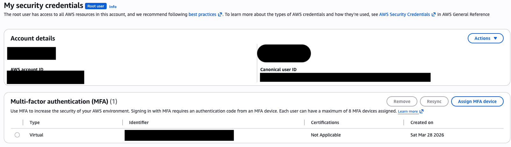
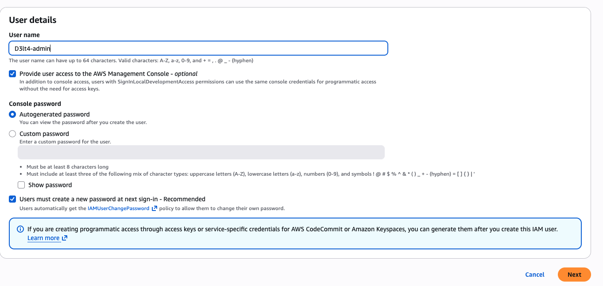
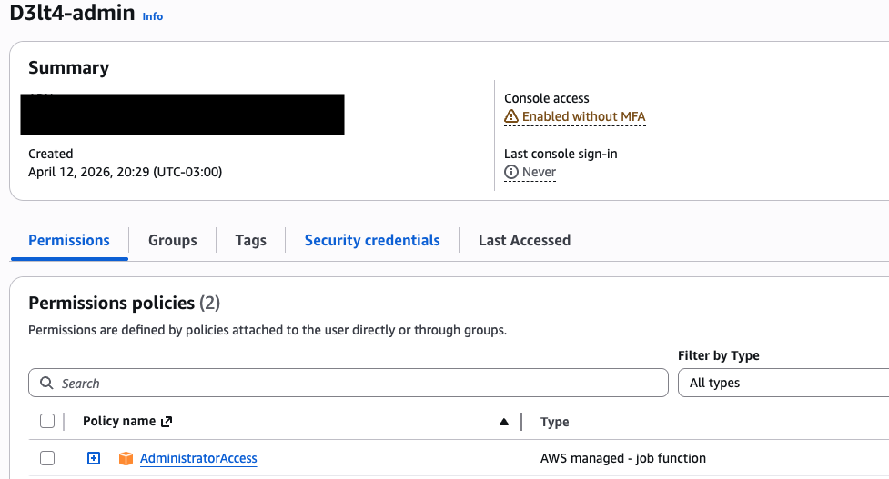

---
tags:
  - aws
  - labs
  - saa-c03
---

# :material-aws: AWS Solutions Architect Labs

## La infraestructura que crece con vos

Serie de labs evolutivos para preparar la certificación **AWS Solutions Architect Associate (SAA-C03)**. Cada lab construye sobre el anterior — no destruís nada entre sesiones. Al final tenés una arquitectura completa de producción.

## Prerequisitos

Antes de arrancar con el Lab 01, necesitás tener la cuenta de AWS lista:

- [ ] MFA activado en la cuenta root
- [ ] Usuario IAM administrador creado (no usar root para los labs)
- [ ] AWS CLI instalado y configurado (`aws sts get-caller-identity` funciona)
- [ ] Alarma de billing configurada (que te avise si te pasás de USD 5)

---

### Asegurar la cuenta root con MFA

La cuenta root tiene acceso total a todo — si alguien la compromete, puede borrar todos tus recursos, crear instancias caras para minar crypto, o directamente cerrar la cuenta. Por eso lo primero que hacemos es activar MFA (Multi-Factor Authentication), que agrega un segundo factor además de la contraseña.

=== "Consola AWS"

    1. Logueate con el **root user** (email + contraseña)
    2. Click en tu nombre de cuenta (esquina superior derecha) → **Security credentials**
    3. En la sección **Multi-factor authentication (MFA)** → **Assign MFA device**
    4. Device name: `root-mfa`
    5. Seleccionar **Authenticator app** → **Next**
    6. Escaneá el QR con tu app de autenticación (Google Authenticator, Authy, 1Password, etc.)
    7. Ingresá dos códigos MFA consecutivos (esperá a que cambie el primero antes de poner el segundo)
    8. **Add MFA**

    > 
    > MFA activado en la cuenta root.

!!! warning "No pierdas el MFA"
    Si perdés acceso a la app de autenticación, perdés acceso a la cuenta root. Guardá los códigos de recuperación o configurá más de un dispositivo MFA.

---

### Crear usuario IAM administrador

La cuenta root no se usa para el día a día — es como loguearse como `root` en Linux. Creamos un usuario IAM con permisos de administrador para trabajar.

=== "Consola AWS"

    1. Ir a **IAM** → **Users** → **Create user**
    2. User name: `admin` (o tu nombre)
    3. Tildar **Provide user access to the AWS Management Console**
    4. Seleccionar **I want to create an IAM user** → definí una contraseña
    5. **Next** → **Attach policies directly**
    6. Buscar y seleccionar **AdministratorAccess** → **Next** → **Create user**
    7. **Importante:** anotá el link de sign-in de la consola IAM (tiene el formato `https://<ACCOUNT_ID>.signin.aws.amazon.com/console`)

    > 
    > Formulario de creación del usuario IAM con acceso a consola.

    > 
    > Usuario `D3lt4-admin` creado con `AdministratorAccess`.

    **Activá MFA también en este usuario** — mismos pasos que para root, desde IAM → Users → tu usuario → Security credentials → Assign MFA device.

!!! tip "De acá en adelante"
    Cerrá sesión del root y logueate con el usuario IAM. Todos los labs se hacen desde este usuario.

---

### Alarma de billing

AWS Free Tier cubre bastante, pero si te olvidás una instancia corriendo o creás un recurso que no es Free Tier, la cuenta de fin de mes te puede sorprender. Configuramos una alarma que te avise por email cuando el gasto estimado supere USD 5.

=== "Consola AWS"

    **Paso 1 — Habilitar alertas de billing:**

    1. Ir a **Billing and Cost Management** → **Billing preferences** (menú lateral)
    2. En **Alert preferences** → **Edit**
    3. Activar **Receive CloudWatch Billing Alerts** → **Save**

    **Paso 2 — Crear la alarma en CloudWatch:**

    1. Ir a **CloudWatch** → **Alarms** → **Billing** → **Create alarm**
    2. Metric: `EstimatedCharges` (namespace `AWS/Billing`, currency USD)
    3. Conditions: **Greater than** → threshold `5` (USD)
    4. **Next** → **Create new SNS topic**
        - Topic name: `billing-alerts`
        - Email: tu email
    5. **Create topic** → **Next**
    6. Alarm name: `gasto-mayor-5usd` → **Create alarm**
    7. **Confirmá la suscripción desde tu email** (te llega un mail de AWS SNS, hacé click en "Confirm subscription")

=== "CLI"

    ```bash
    # 1. Crear topic SNS
    aws sns create-topic --name billing-alerts
    # Anotá el TopicArn

    # 2. Suscribir tu email
    aws sns subscribe \
      --topic-arn <TOPIC_ARN> \
      --protocol email \
      --notification-endpoint tu-email@gmail.com
    # Confirmá desde tu email

    # 3. Crear la alarma
    aws cloudwatch put-metric-alarm \
      --alarm-name "gasto-mayor-5usd" \
      --metric-name EstimatedCharges \
      --namespace AWS/Billing \
      --statistic Maximum \
      --period 21600 \
      --threshold 5 \
      --comparison-operator GreaterThanThreshold \
      --evaluation-periods 1 \
      --alarm-actions <TOPIC_ARN> \
      --dimensions Name=Currency,Value=USD
    ```

### Archivo de IDs: tu estado sin Terraform

Creá `mis-recursos.sh` y actualizalo en cada lab. Antes de cada sesión: `source mis-recursos.sh`.

```bash
#!/bin/bash
# mis-recursos.sh — Actualizar en cada lab con los IDs reales
# Ejecutar: source mis-recursos.sh

# Lab 01
export VPC_ID="vpc-XXXXXXXXX"
export PUB_SUBNET_A="subnet-XXXXXXXXX"
export PUB_SUBNET_B="subnet-XXXXXXXXX"
export PRIV_SUBNET_A="subnet-XXXXXXXXX"
export PRIV_SUBNET_B="subnet-XXXXXXXXX"
export IGW_ID="igw-XXXXXXXXX"
export PUBLIC_RT="rtb-XXXXXXXXX"
export PRIVATE_RT="rtb-XXXXXXXXX"
export WEB_SG="sg-XXXXXXXXX"
export KEY_PAIR="d3lt4-key"
export WEB_INSTANCE_ID="i-XXXXXXXXX"
export NAT_SG="sg-XXXXXXXXX"
export NAT_INSTANCE_ID="i-XXXXXXXXX"
export PRIV_SG="sg-XXXXXXXXX"

echo "Variables cargadas. VPC: $VPC_ID"
```

### Script de limpieza

Corré esto al terminar cada sesión — solo mata lo que cobra:

```bash
#!/bin/bash
# cleanup.sh — Elimina solo los recursos que cobran

echo "Buscando NAT Gateways activos..."
for nat in $(aws ec2 describe-nat-gateways \
  --filter Name=state,Values=available \
  --query 'NatGateways[].NatGatewayId' --output text 2>/dev/null); do
  echo "   Eliminando NAT Gateway: $nat"
  aws ec2 delete-nat-gateway --nat-gateway-id $nat
done

echo "Buscando Elastic IPs sueltas..."
for eip in $(aws ec2 describe-addresses \
  --query 'Addresses[?AssociationId==null].AllocationId' --output text 2>/dev/null); do
  echo "   Liberando EIP: $eip"
  aws ec2 release-address --allocation-id $eip
done

echo "Buscando EBS volumes huérfanos..."
for vol in $(aws ec2 describe-volumes \
  --filters Name=status,Values=available \
  --query 'Volumes[].VolumeId' --output text 2>/dev/null); do
  echo "   Eliminando volumen: $vol"
  aws ec2 delete-volume --volume-id $vol
done

echo "Limpieza terminada."
```

## Labs

| Lab | Tema | Duración |
|-----|------|----------|
| [Lab 01 — VPC + EC2 + NAT Instance](lab-01-vpc-ec2-nat.md) | La red completa | ~2 hs |
| Lab 02 — ALB + Auto Scaling Group | *próximamente* |
| Lab 03 — RDS MySQL | *próximamente* |
| Más labs en camino... | |
