---
tags:
  - aws
  - vpc
  - ec2
  - nat
  - networking
  - saa-c03
---

# Lab 01 — VPC + EC2 + NAT Instance: La Red Completa

**Lo que construimos:** La base de red sobre la que se apoya todo lo demás — una VPC con subnets públicas y privadas, un web server accesible desde internet, y una NAT Instance para que las subnets privadas tengan salida a internet.

**Servicios:** VPC, Subnets, Internet Gateway, Route Tables, EC2, Security Groups, Key Pair, User Data, IMDSv2, iptables, IP Forwarding

**Duración:** ~2 horas

**Costo:** USD 0.00 (todo Free Tier)

## Arquitectura final del lab

<!-- Insertar diagrama Excalidraw exportado como PNG -->
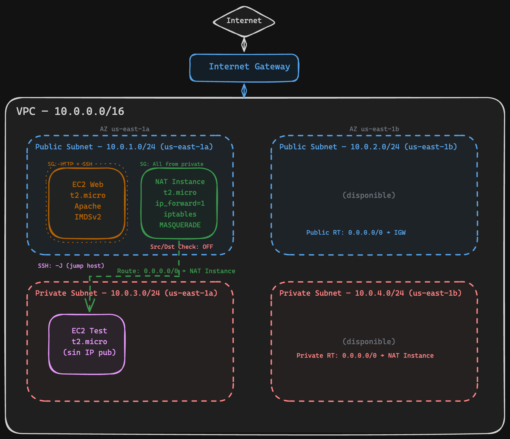

---

## Parte 1 — VPC + Subnets + Internet Gateway

### Qué es una VPC y por qué la necesitamos

Cuando creás una cuenta de AWS, no tenés red propia — tenés la "default VPC" que AWS crea por vos, pero para un entorno real necesitás armar la tuya.

Una **VPC (Virtual Private Cloud)** es tu red privada dentro de AWS. Pensala como tu propio datacenter virtual: vos decidís qué rangos de IP usa, cómo se divide en segmentos, qué tiene acceso a internet y qué no. Todo lo que deployés en AWS (EC2, RDS, Lambda con VPC, etc.) vive dentro de una VPC.

**Conceptos clave antes de arrancar:**

- **Región:** Una VPC vive dentro de una región de AWS (nosotros usamos `us-east-1`, Virginia). No puede cruzar regiones.
- **CIDR block:** El rango de IPs privadas de tu VPC. Nosotros usamos `10.0.0.0/16`, que nos da 65,536 direcciones IP. Es el rango más común para labs y entornos de desarrollo.
- **DNS hostnames:** Si lo activás, cada EC2 que levantes recibe un nombre DNS público (tipo `ec2-54-123-45-67.compute-1.amazonaws.com`). Lo necesitamos para poder acceder a las instancias por nombre.

### 1.1 Crear la VPC

=== "Consola AWS"

    1. Ir a **VPC** → **Your VPCs** → **Create VPC**
    2. Seleccionar **VPC only** (no "VPC and more", queremos hacerlo paso a paso para entender)
    3. Name tag: `d3lt4-vpc`
    4. IPv4 CIDR block: `10.0.0.0/16`
    5. Click **Create VPC**
    6. Una vez creada, seleccioná la VPC → **Actions** → **Edit VPC settings**
    7. Activar **Enable DNS hostnames** → Save

    > 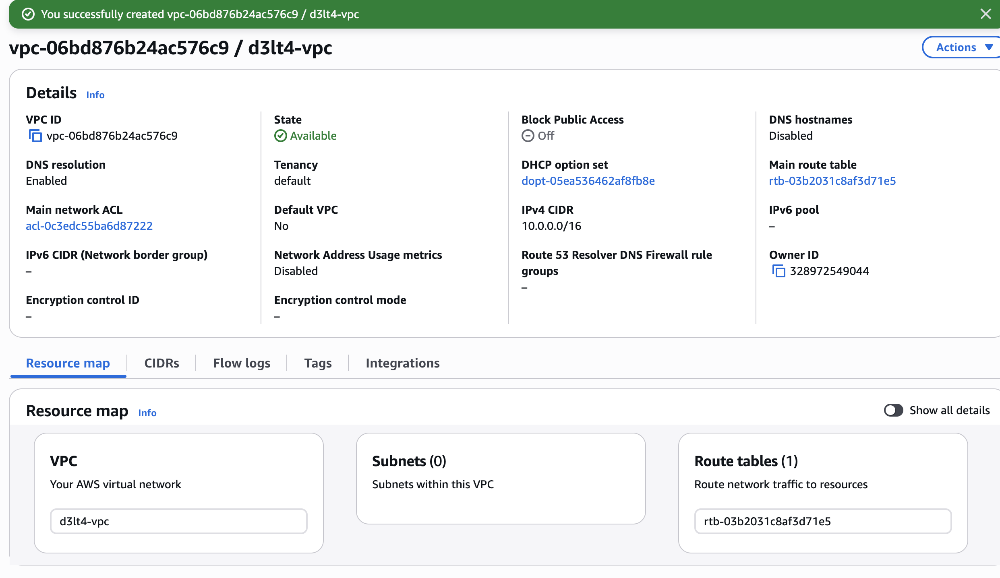
    > VPC creada con el CIDR `10.0.0.0/16`.

    > 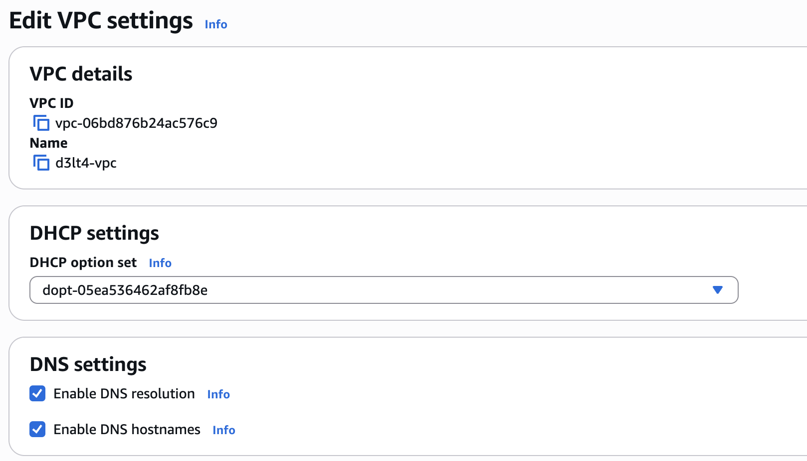
    > DNS hostnames habilitado.

=== "CLI"

    ```bash
    aws ec2 create-vpc \
      --cidr-block 10.0.0.0/16 \
      --tag-specifications 'ResourceType=vpc,Tags=[{Key=Name,Value=d3lt4-vpc}]'

    aws ec2 modify-vpc-attribute --vpc-id $VPC_ID --enable-dns-hostnames '{"Value": true}'
    aws ec2 modify-vpc-attribute --vpc-id $VPC_ID --enable-dns-support '{"Value": true}'
    ```

### Qué son las Subnets y por qué dividimos en públicas y privadas

Una **subnet** es un segmento de tu VPC. Así como en una oficina tenés la red de empleados y la red de servidores separadas, acá dividimos la VPC en subnets para separar lo que es accesible desde internet (público) de lo que no (privado).

**¿Por qué esta separación importa?**

- En la **subnet pública** ponemos lo que necesita ser accesible desde afuera: web servers, balanceadores, bastions.
- En la **subnet privada** ponemos lo que NO debe ser accesible directamente: bases de datos, servidores de aplicación, caches. Si alguien compromete tu web server, no puede llegar directo a la base de datos.

**¿Por qué 2 Availability Zones?**

Cada AZ es un datacenter físico separado (o grupo de datacenters). Si `us-east-1a` se cae (pasa), tus recursos en `us-east-1b` siguen funcionando. Por eso creamos subnets en 2 AZs — para alta disponibilidad. Servicios como ALB y RDS te van a pedir subnets en al menos 2 AZs.

**El plan de subnets:**

| Nombre | CIDR | AZ | Tipo | Para qué |
|--------|------|----|------|----------|
| `d3lt4-public-1a` | `10.0.1.0/24` (256 IPs) | us-east-1a | Pública | Web server, NAT Instance |
| `d3lt4-public-1b` | `10.0.2.0/24` (256 IPs) | us-east-1b | Pública | Disponible para HA |
| `d3lt4-private-1a` | `10.0.3.0/24` (256 IPs) | us-east-1a | Privada | Instancias internas, futuro RDS |
| `d3lt4-private-1b` | `10.0.4.0/24` (256 IPs) | us-east-1b | Privada | Disponible para HA |

!!! note "¿256 IPs pero solo 251 usables?"
    AWS reserva 5 IPs de cada subnet: la primera (dirección de red), la segunda (router de la VPC), la tercera (DNS de AWS), la cuarta (reservada para futuro) y la última (broadcast).

### 1.2 Crear las 4 subnets

=== "Consola AWS"

    Ir a **VPC** → **Subnets** → **Create subnet**. Seleccioná la VPC `d3lt4-vpc` y creá las 4 subnets:

    | Name | AZ | CIDR |
    |------|----|------|
    | `d3lt4-public-1a` | us-east-1a | `10.0.1.0/24` |
    | `d3lt4-public-1b` | us-east-1b | `10.0.2.0/24` |
    | `d3lt4-private-1a` | us-east-1a | `10.0.3.0/24` |
    | `d3lt4-private-1b` | us-east-1b | `10.0.4.0/24` |

    !!! tip "Podés agregar las 4 en la misma pantalla"
        Después de llenar la primera, hacé click en **Add new subnet** abajo para agregar las demás sin salir del formulario.

    > 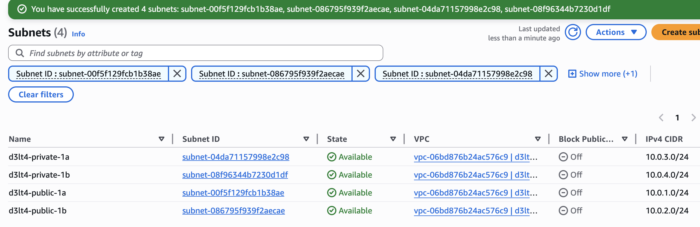
    > Las 4 subnets creadas en la tabla de Subnets, con sus CIDRs y AZs.

=== "CLI"

    ```bash
    # Públicas
    aws ec2 create-subnet --vpc-id $VPC_ID --cidr-block 10.0.1.0/24 \
      --availability-zone us-east-1a \
      --tag-specifications 'ResourceType=subnet,Tags=[{Key=Name,Value=d3lt4-public-1a}]'

    aws ec2 create-subnet --vpc-id $VPC_ID --cidr-block 10.0.2.0/24 \
      --availability-zone us-east-1b \
      --tag-specifications 'ResourceType=subnet,Tags=[{Key=Name,Value=d3lt4-public-1b}]'

    # Privadas
    aws ec2 create-subnet --vpc-id $VPC_ID --cidr-block 10.0.3.0/24 \
      --availability-zone us-east-1a \
      --tag-specifications 'ResourceType=subnet,Tags=[{Key=Name,Value=d3lt4-private-1a}]'

    aws ec2 create-subnet --vpc-id $VPC_ID --cidr-block 10.0.4.0/24 \
      --availability-zone us-east-1b \
      --tag-specifications 'ResourceType=subnet,Tags=[{Key=Name,Value=d3lt4-private-1b}]'
    ```

### Qué es un Internet Gateway

Hasta acá tenés una red completamente aislada. Las subnets no tienen forma de hablar con internet. El **Internet Gateway (IGW)** es la puerta de salida: conecta tu VPC con internet.

Pero ojo — que exista el IGW no significa que todo tiene internet automáticamente. Necesitás decirle a cada subnet "para llegar a internet, usá el IGW". Eso se hace con las Route Tables.

Una analogía: el IGW es la puerta del edificio. La Route Table es el cartel que dice "para salir a la calle, andá a la puerta".

### 1.3 Internet Gateway

=== "Consola AWS"

    1. Ir a **VPC** → **Internet Gateways** → **Create internet gateway**
    2. Name tag: `d3lt4-igw`
    3. Click **Create internet gateway**
    4. En la pantalla del IGW recién creado, click **Actions** → **Attach to VPC**
    5. Seleccionar `d3lt4-vpc` → **Attach internet gateway**

    > 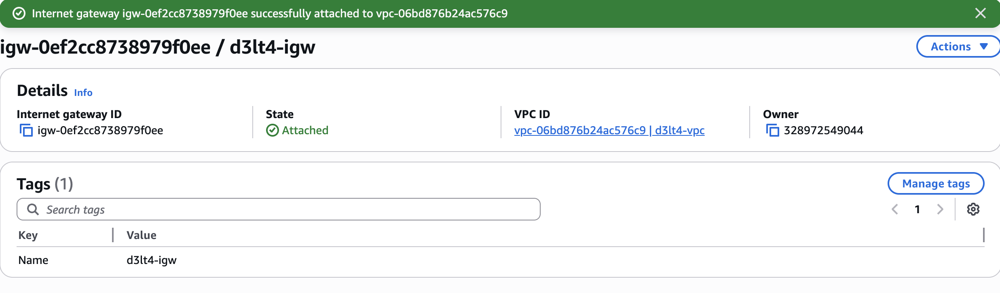
    > Internet Gateway en estado `Attached` a la VPC.

=== "CLI"

    ```bash
    aws ec2 create-internet-gateway \
      --tag-specifications 'ResourceType=internet-gateway,Tags=[{Key=Name,Value=d3lt4-igw}]'

    aws ec2 attach-internet-gateway --internet-gateway-id $IGW_ID --vpc-id $VPC_ID
    ```

### Qué son las Route Tables

Una **Route Table** es una tabla de enrutamiento — le dice al tráfico "para llegar a este destino, andá por acá". Cada subnet tiene asociada una Route Table.

**¿Qué hace que una subnet sea "pública"?** Una sola cosa: que su Route Table tenga una ruta `0.0.0.0/0 → Internet Gateway`. `0.0.0.0/0` significa "cualquier destino que no sea la VPC". Entonces: "para todo lo que no sea tráfico interno, mandalo al IGW (internet)".

La subnet privada, en cambio, NO tiene esa ruta. Su tráfico no tiene forma de salir a internet (todavía — eso lo resolvemos en la Parte 3 con la NAT Instance).

**También habilitamos auto-assign public IP** en las subnets públicas. Esto hace que cada EC2 que lancemos ahí reciba automáticamente una IP pública. Sin esto, la EC2 tendría ruta al IGW pero no tendría IP pública para que internet le responda — como tener la puerta abierta pero sin dirección postal.

### 1.4 Route Tables

=== "Consola AWS"

    **Route Table pública:**

    1. Ir a **VPC** → **Route Tables** → **Create route table**
    2. Name: `d3lt4-public-rt`, VPC: `d3lt4-vpc` → **Create**
    3. Seleccionar la route table → pestaña **Routes** → **Edit routes** → **Add route**
        - Destination: `0.0.0.0/0`
        - Target: **Internet Gateway** → seleccionar `d3lt4-igw`
        - **Save changes**
    4. Pestaña **Subnet associations** → **Edit subnet associations**
        - Seleccionar `d3lt4-public-1a` y `d3lt4-public-1b` → **Save associations**

    **Habilitar auto-assign IP pública en subnets públicas:**

    5. Ir a **VPC** → **Subnets** → seleccionar `d3lt4-public-1a`
    6. **Actions** → **Edit subnet settings** → activar **Enable auto-assign public IPv4 address** → **Save**
    7. Repetir para `d3lt4-public-1b`

    **Route Table privada:**

    8. **Create route table** → Name: `d3lt4-private-rt`, VPC: `d3lt4-vpc` → **Create**
    9. Pestaña **Subnet associations** → **Edit subnet associations**
        - Seleccionar `d3lt4-private-1a` y `d3lt4-private-1b` → **Save associations**
    10. **No agregar ruta a internet todavía** — eso lo hacemos en la Parte 3 con la NAT Instance.

    > 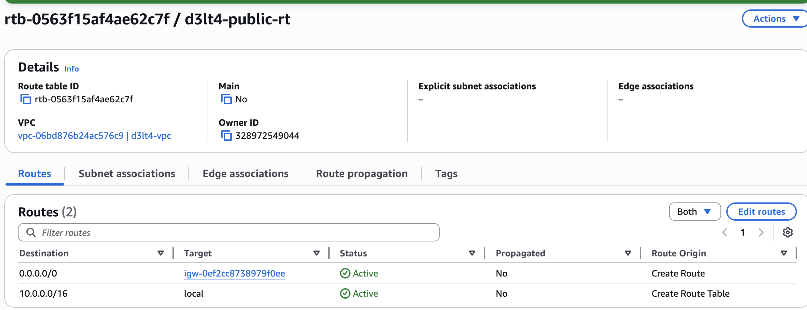
    > Route table pública con la ruta `0.0.0.0/0 → igw-xxx` y las 2 subnets asociadas.

=== "CLI"

    ```bash
    # Route table pública
    aws ec2 create-route-table --vpc-id $VPC_ID \
      --tag-specifications 'ResourceType=route-table,Tags=[{Key=Name,Value=d3lt4-public-rt}]'

    aws ec2 create-route --route-table-id $PUBLIC_RT \
      --destination-cidr-block 0.0.0.0/0 --gateway-id $IGW_ID

    aws ec2 associate-route-table --route-table-id $PUBLIC_RT --subnet-id $PUB_SUBNET_A
    aws ec2 associate-route-table --route-table-id $PUBLIC_RT --subnet-id $PUB_SUBNET_B

    # Auto-assign IP pública
    aws ec2 modify-subnet-attribute --subnet-id $PUB_SUBNET_A --map-public-ip-on-launch
    aws ec2 modify-subnet-attribute --subnet-id $PUB_SUBNET_B --map-public-ip-on-launch

    # Route table privada (sin ruta a internet por ahora)
    aws ec2 create-route-table --vpc-id $VPC_ID \
      --tag-specifications 'ResourceType=route-table,Tags=[{Key=Name,Value=d3lt4-private-rt}]'

    aws ec2 associate-route-table --route-table-id $PRIVATE_RT --subnet-id $PRIV_SUBNET_A
    aws ec2 associate-route-table --route-table-id $PRIVATE_RT --subnet-id $PRIV_SUBNET_B
    ```

### Verificación Parte 1

=== "Consola AWS"

    Ir a **VPC** → **Subnets** → filtrar por VPC `d3lt4-vpc`. Deberías ver las 4 subnets con sus CIDRs y AZs.

    Verificá también:

    - **Route Tables:** que `d3lt4-public-rt` tenga la ruta `0.0.0.0/0 → igw-xxx` y las 2 subnets públicas asociadas
    - **Route Tables:** que `d3lt4-private-rt` tenga solo la ruta local (`10.0.0.0/16 → local`) y las 2 subnets privadas asociadas
    - **Internet Gateway:** que `d3lt4-igw` esté en estado `Attached`

=== "CLI"

    ```bash
    aws ec2 describe-subnets --filters "Name=vpc-id,Values=$VPC_ID" \
      --query 'Subnets[].[Tags[?Key==`Name`].Value|[0],CidrBlock,AvailabilityZone]' \
      --output table
    ```

---

## Parte 2 — EC2 Web Server en la Subnet Pública

### Qué es EC2

**EC2 (Elastic Compute Cloud)** es el servicio de máquinas virtuales de AWS. Cada instancia EC2 es un servidor virtual que corre en el hardware de AWS. Vos elegís el sistema operativo (AMI), la potencia de la máquina (instance type) y en qué subnet vive.

**Conceptos que vamos a usar:**

- **AMI (Amazon Machine Image):** La imagen del sistema operativo. Nosotros usamos Amazon Linux 2, que es un Linux basado en RHEL optimizado para AWS. Es Free Tier y viene con las herramientas de AWS preinstaladas.
- **Instance Type:** Define CPU, RAM y capacidad de red. `t2.micro` tiene 1 vCPU y 1 GB RAM — es lo que cubre Free Tier. La "t" significa "burstable": normalmente usa poca CPU, pero puede "explotar" por ráfagas cortas usando créditos.
- **Key Pair:** Un par de claves SSH (pública + privada). AWS guarda la pública dentro de la EC2 y vos te quedás con la privada (el `.pem`). Es la única forma de conectarte por SSH.
- **Security Group:** Es un firewall virtual que controla qué tráfico puede entrar y salir de la instancia. Funciona a nivel de instancia (no de subnet). Por defecto, bloquea todo el tráfico de entrada y permite todo el de salida.
- **User Data:** Un script que se ejecuta automáticamente cuando la instancia arranca por primera vez. Corre como root. Sirve para instalar software, configurar servicios, etc., sin tener que conectarte manualmente.

### 2.1 Crear Key Pair

=== "Consola AWS"

    1. Ir a **EC2** → **Key Pairs** (en el menú lateral, sección Network & Security)
    2. **Create key pair**
    3. Name: `d3lt4-key`
    4. Type: **RSA**
    5. Private key file format: **.pem**
    6. Click **Create key pair** — se descarga automáticamente el archivo `.pem`

    !!! warning "Guardá bien el .pem"
        Es la **única vez** que podés descargarlo. Si lo perdés, no podés acceder por SSH a las instancias que lo usen. Guardalo en un lugar seguro y hacé `chmod 400 d3lt4-key.pem` desde tu terminal para que solo vos puedas leerlo.

    > 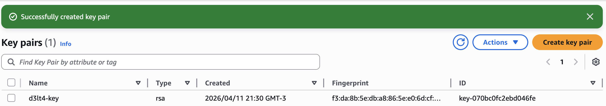
    > Key pair creado en la lista de Key Pairs.

=== "CLI"

    ```bash
    aws ec2 create-key-pair \
      --key-name d3lt4-key \
      --query 'KeyMaterial' --output text > d3lt4-key.pem

    chmod 400 d3lt4-key.pem
    ```

### 2.2 Security Group para el web server

El Security Group es el firewall de la instancia. Acá definimos qué tráfico puede entrar:

- **SSH (puerto 22)** solo desde tu IP — para que puedas conectarte a administrar. Nunca abras SSH a `0.0.0.0/0` en un entorno real, cualquiera podría intentar conectarse.
- **HTTP (puerto 80)** desde cualquier IP — porque es un web server público, queremos que cualquiera pueda verlo.

=== "Consola AWS"

    1. Ir a **EC2** → **Security Groups** → **Create security group**
    2. Name: `d3lt4-web-sg`
    3. Description: `Web server - HTTP + SSH`
    4. VPC: `d3lt4-vpc`
    5. **Inbound rules** → **Add rule**:

        | Type | Port | Source | Descripción |
        |------|------|--------|-------------|
        | SSH | 22 | **My IP** (se autocompleta con tu IP) | SSH desde mi IP |
        | HTTP | 80 | `0.0.0.0/0` (Anywhere IPv4) | HTTP público |

    6. **Create security group**

    > 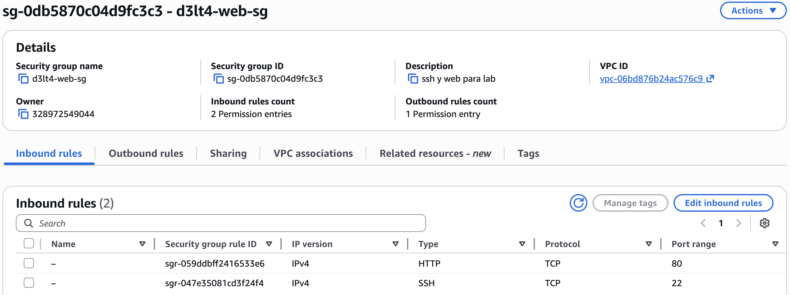
    > Security Group con las 2 reglas de inbound (SSH + HTTP).

=== "CLI"

    ```bash
    aws ec2 create-security-group \
      --group-name d3lt4-web-sg \
      --description "Web server - HTTP + SSH" \
      --vpc-id $VPC_ID

    MY_IP=$(curl -s ifconfig.me)
    aws ec2 authorize-security-group-ingress \
      --group-id $WEB_SG --protocol tcp --port 22 --cidr $MY_IP/32

    aws ec2 authorize-security-group-ingress \
      --group-id $WEB_SG --protocol tcp --port 80 --cidr 0.0.0.0/0
    ```

### 2.3 Lanzar la EC2 con User Data

Vamos a lanzar una EC2 con un script de User Data que:

1. Instala Apache (el web server)
2. Consulta la **metadata de la instancia** usando IMDSv2
3. Genera una página HTML con esa información

**¿Qué es el User Data?** Es un script bash que AWS ejecuta automáticamente como `root` la primera vez que la instancia arranca. Es la forma de automatizar la configuración inicial sin tener que conectarte por SSH y hacer todo a mano.

=== "Consola AWS"

    1. Ir a **EC2** → **Instances** → **Launch instances**
    2. Name: `d3lt4-web-01`
    3. **AMI:** Amazon Linux 2 (debería ser la primera opción, Free tier eligible)
    4. **Instance type:** `t2.micro` (Free tier eligible)
    5. **Key pair:** `d3lt4-key`
    6. **Network settings** → **Edit**:
        - VPC: `d3lt4-vpc`
        - Subnet: `d3lt4-public-1a`
        - Auto-assign public IP: **Enable**
        - Select existing security group: `d3lt4-web-sg`
    7. **Advanced details** → Scroll hasta el final donde dice **User data** y pegar este script:

    ```bash
    #!/bin/bash
    yum update -y
    yum install -y httpd stress

    systemctl start httpd
    systemctl enable httpd

    TOKEN=$(curl -s -X PUT "http://169.254.169.254/latest/api/token" \
      -H "X-aws-ec2-metadata-token-ttl-seconds: 21600")
    INSTANCE_ID=$(curl -s -H "X-aws-ec2-metadata-token: $TOKEN" \
      http://169.254.169.254/latest/meta-data/instance-id)
    AZ=$(curl -s -H "X-aws-ec2-metadata-token: $TOKEN" \
      http://169.254.169.254/latest/meta-data/placement/availability-zone)
    LOCAL_IP=$(curl -s -H "X-aws-ec2-metadata-token: $TOKEN" \
      http://169.254.169.254/latest/meta-data/local-ipv4)

    cat << HTML > /var/www/html/index.html
    <!DOCTYPE html>
    <html>
    <head><title>D3LT4 Protocol</title>
    <style>
      body { background:#0d1117; color:#c9d1d9; font-family:monospace; padding:40px; }
      h1 { color:#58a6ff; }
      .info { background:#161b22; border:1px solid #30363d; padding:20px; border-radius:8px; }
      .label { color:#8b949e; }
      .value { color:#f0883e; }
    </style></head>
    <body>
      <h1>The D3LT4 Protocol — AWS Lab 01</h1>
      <div class="info">
        <p><span class="label">Instance ID:</span> <span class="value">$INSTANCE_ID</span></p>
        <p><span class="label">AZ:</span> <span class="value">$AZ</span></p>
        <p><span class="label">Private IP:</span> <span class="value">$LOCAL_IP</span></p>
      </div>
    </body>
    </html>
    HTML
    ```

    8. Click **Launch instance**
    9. Esperá ~2 minutos a que el estado pase a **Running** y el status check diga **2/2 checks passed**

    > 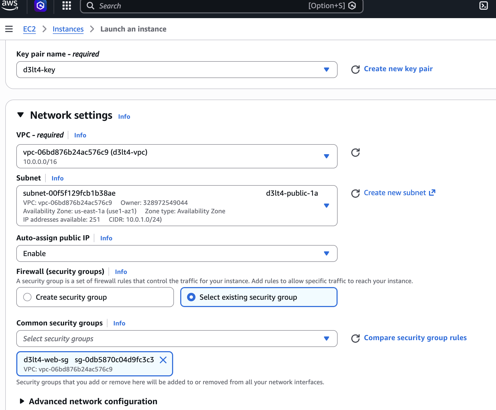
    > Network settings del launch: VPC `d3lt4-vpc`, subnet `d3lt4-public-1a`, auto-assign IP habilitado, SG `d3lt4-web-sg`.

=== "CLI"

    ```bash
    aws ec2 run-instances \
      --image-id ami-0c02fb55956c7d316 \
      --instance-type t2.micro \
      --subnet-id $PUB_SUBNET_A \
      --security-group-ids $WEB_SG \
      --key-name $KEY_PAIR \
      --user-data file://web-server-setup.sh \
      --tag-specifications 'ResourceType=instance,Tags=[{Key=Name,Value=d3lt4-web-01}]'
    ```

### 2.4 Probar el web server

1. Copiá la **Public IPv4 address** de la instancia desde la consola de EC2
2. Abrí un browser y entrá a `http://<IP_PUBLICA>`
3. Deberías ver la página D3LT4 con Instance ID, AZ y Private IP

> 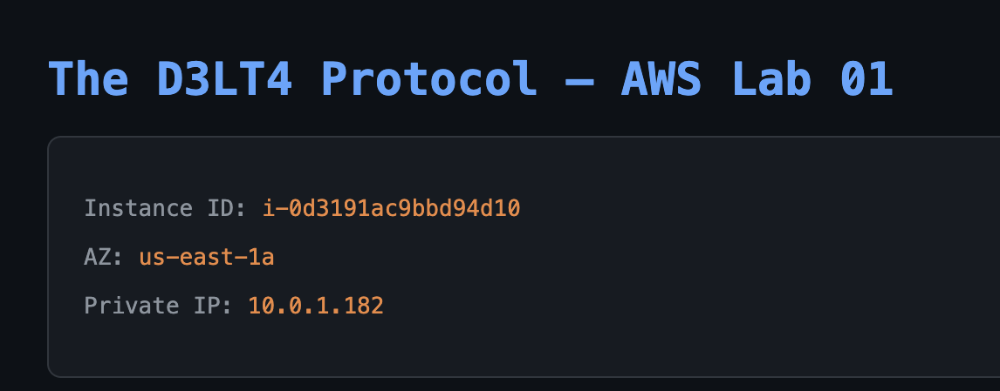
> La página web D3LT4 en el browser mostrando la metadata de la instancia.

### 2.5 Explorar Instance Metadata (IMDSv2)

#### ¿Qué es la Instance Metadata?

Cada EC2 tiene acceso a un servicio interno en la IP `169.254.169.254` que le da información sobre sí misma: su ID, su AZ, su IP, el Security Group que tiene, el User Data que se ejecutó, etc. Esto lo usa mucho el software que corre dentro de la instancia para auto-configurarse.

#### ¿Qué es IMDSv2 y por qué importa?

IMDS = **Instance Metadata Service**. Hay dos versiones:

- **IMDSv1 (viejo):** Hacés un `curl` directo a `169.254.169.254` y te devuelve la data. El problema: si un atacante logra un SSRF (Server-Side Request Forgery) en tu aplicación, puede hacer ese mismo curl y robar las credenciales del IAM Role de la instancia. Esto fue exactamente lo que pasó en el [breach de Capital One en 2019](https://en.wikipedia.org/wiki/2019_Capital_One_data_breach).
- **IMDSv2 (nuevo y más seguro):** Primero tenés que pedir un **token** con un PUT, y después usar ese token en cada request. Un SSRF típico no puede hacer el PUT inicial, así que no puede robar la metadata. AWS recomienda siempre usar v2.

Conectate por SSH a la instancia:

```bash
ssh -i d3lt4-key.pem ec2-user@<IP_PUBLICA>
```

> 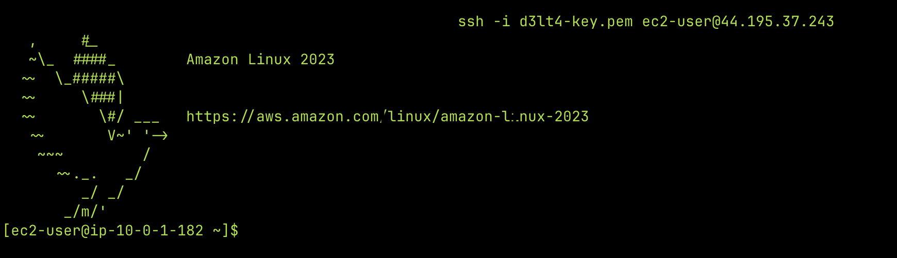
> SSH a la EC2 del web server.

Ya adentro de la EC2:

```bash
# Paso 1: Pedir el token (esto es lo que hace IMDSv2 más seguro)
TOKEN=$(curl -s -X PUT "http://169.254.169.254/latest/api/token" \
  -H "X-aws-ec2-metadata-token-ttl-seconds: 21600")

# Paso 2: Usar el token para consultar metadata
curl -s -H "X-aws-ec2-metadata-token: $TOKEN" http://169.254.169.254/latest/meta-data/
curl -s -H "X-aws-ec2-metadata-token: $TOKEN" http://169.254.169.254/latest/meta-data/instance-type
curl -s -H "X-aws-ec2-metadata-token: $TOKEN" http://169.254.169.254/latest/meta-data/public-ipv4
curl -s -H "X-aws-ec2-metadata-token: $TOKEN" http://169.254.169.254/latest/meta-data/security-groups

# También podés ver el User Data que se ejecutó al arrancar
curl -s -H "X-aws-ec2-metadata-token: $TOKEN" http://169.254.169.254/latest/user-data
```

!!! warning "IMDSv2 y SSRF"
    La forma de proteger la metadata de instancias contra SSRF es **usar IMDSv2** (require token). La IP del servicio de metadata es siempre `169.254.169.254`.

> 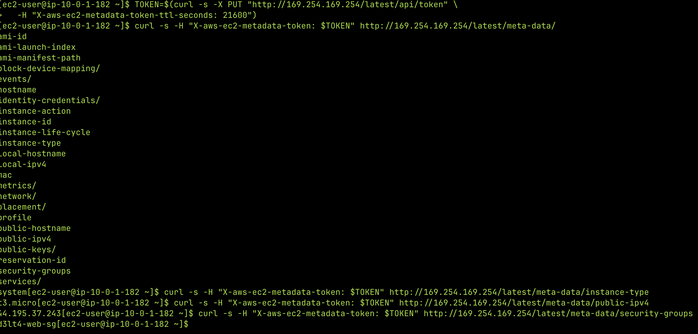
> Output de los comandos de metadata en la terminal SSH.

### Verificación Parte 2

- [ ] `http://<IP>` muestra la página D3LT4 en el browser
- [ ] SSH a la instancia funciona
- [ ] IMDSv2 responde correctamente con el token

---

## Parte 3 — NAT Instance: Internet para la Subnet Privada

### El problema que resolvemos

La subnet privada no tiene ruta a internet. Eso es intencional — no queremos que nadie desde internet pueda llegar a esas instancias. Pero las instancias privadas sí necesitan salir a internet para cosas como:

- Descargar actualizaciones del SO (`yum update`)
- Descargar paquetes y dependencias
- Conectarse a APIs externas

**La solución: NAT (Network Address Translation).** Un NAT permite que las instancias privadas salgan a internet usando la IP pública de otro recurso, sin ser accesibles directamente desde internet. Es como usar un proxy: la instancia privada le dice al NAT "hacé este request por mí", el NAT lo hace con su IP pública, recibe la respuesta y se la devuelve a la instancia privada.

### NAT Gateway vs NAT Instance: por qué elegimos Instance

AWS te ofrece dos opciones:

| | NAT Gateway (managed) | NAT Instance (manual) |
|---|---|---|
| **Costo** | ~USD 0.045/hora (~$32/mes) + data transfer | Free Tier (es una EC2 t2.micro) |
| **Mantenimiento** | AWS lo administra | Vos lo administrás |
| **Alta disponibilidad** | Redundante dentro de una AZ | Single point of failure |
| **Rendimiento** | Hasta 100 Gbps | Depende del instance type |
| **Security Groups** | No aplican (usa NACLs) | Sí aplican |
| **Puede ser bastion** | No | Sí |

Para producción usarías NAT Gateway. Para aprender, la NAT Instance es mejor porque:

1. Es gratis (Free Tier)
2. Aprendés iptables, IP forwarding y Source/Dest Check — conceptos fundamentales de networking
3. Entendés cómo funciona NAT por dentro, no como una caja negra

### 3.1 Security Group para la NAT Instance

Este Security Group permite:

- **Todo el tráfico desde las subnets privadas** — porque la NAT tiene que poder recibir los paquetes que las instancias privadas quieren mandar a internet
- **SSH desde tu IP** — para poder conectarte y configurar iptables

=== "Consola AWS"

    1. Ir a **EC2** → **Security Groups** → **Create security group**
    2. Name: `d3lt4-nat-sg`
    3. Description: `NAT Instance - trafico de subnets privadas`
    4. VPC: `d3lt4-vpc`
    5. **Inbound rules** → **Add rule**:

        | Type | Port | Source | Descripción |
        |------|------|--------|-------------|
        | All traffic | All | `10.0.3.0/24` | Todo desde private-1a |
        | All traffic | All | `10.0.4.0/24` | Todo desde private-1b |
        | SSH | 22 | **My IP** | SSH para configurar |

    6. **Create security group**

    > 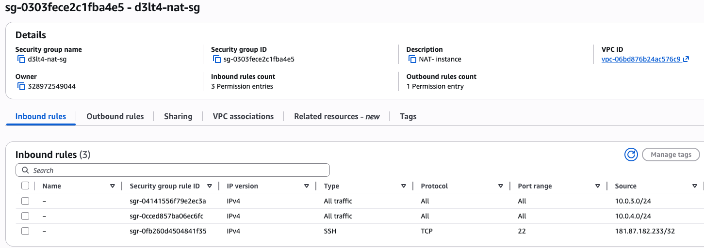
    > Security Group de la NAT con las 3 reglas de inbound.

=== "CLI"

    ```bash
    aws ec2 create-security-group \
      --group-name d3lt4-nat-sg \
      --description "NAT Instance - trafico de subnets privadas" \
      --vpc-id $VPC_ID

    aws ec2 authorize-security-group-ingress \
      --group-id $NAT_SG --protocol -1 --cidr 10.0.3.0/24
    aws ec2 authorize-security-group-ingress \
      --group-id $NAT_SG --protocol -1 --cidr 10.0.4.0/24
    aws ec2 authorize-security-group-ingress \
      --group-id $NAT_SG --protocol tcp --port 22 --cidr $(curl -s ifconfig.me)/32
    ```

### 3.2 Lanzar la NAT Instance

=== "Consola AWS"

    1. **EC2** → **Instances** → **Launch instances**
    2. Name: `d3lt4-nat-instance`
    3. AMI: **Amazon Linux 2** (Free tier)
    4. Instance type: `t2.micro`
    5. Key pair: `d3lt4-key`
    6. Network settings → Edit:
        - VPC: `d3lt4-vpc`
        - Subnet: `d3lt4-public-1a`
        - Auto-assign public IP: **Enable**
        - Select existing security group: `d3lt4-nat-sg`
    7. **Launch instance**
    8. Esperá a que esté en **Running**

    > 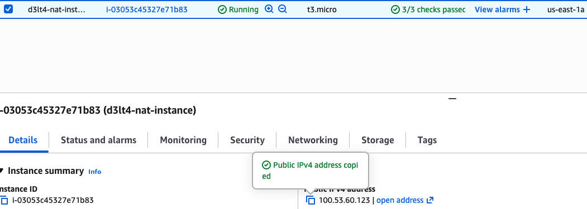
    > Instancia `d3lt4-nat-instance` en Running.

=== "CLI"

    ```bash
    aws ec2 run-instances \
      --image-id ami-0c02fb55956c7d316 \
      --instance-type t2.micro \
      --subnet-id $PUB_SUBNET_A \
      --security-group-ids $NAT_SG \
      --key-name $KEY_PAIR \
      --tag-specifications 'ResourceType=instance,Tags=[{Key=Name,Value=d3lt4-nat-instance}]'
    ```

### 3.3 Deshabilitar Source/Destination Check

#### ¿Qué es y por qué hay que deshabilitarlo?

Por defecto, AWS verifica que cada paquete que entra o sale de una ENI (la tarjeta de red virtual) tenga como origen o destino la IP de esa ENI. Si no coincide, AWS descarta el paquete. Esto es una medida de seguridad para evitar spoofing.

Pero una NAT Instance necesita **reenviar paquetes que no son suyos**. Recibe un paquete con origen `10.0.3.10` (la instancia privada) y destino `142.250.80.46` (google.com) — ninguna de esas IPs es la de la NAT Instance. Si el Source/Dest Check está activo, AWS tira ese paquete a la basura.

**Deshabilitarlo es obligatorio para cualquier instancia que haga de router, NAT o firewall.**

=== "Consola AWS"

    1. Seleccionar la instancia `d3lt4-nat-instance`
    2. **Actions** → **Networking** → **Change source/destination check**
    3. Activar **Stop** (deshabilitar el check) → **Save**

    > 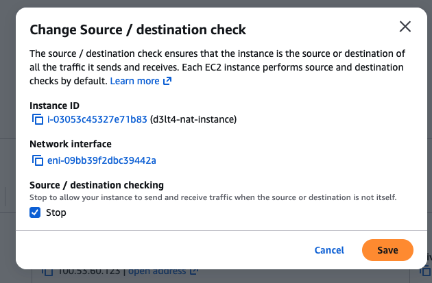
    > Source/destination check deshabilitado.

=== "CLI"

    ```bash
    aws ec2 modify-instance-attribute \
      --instance-id $NAT_INSTANCE_ID \
      --no-source-dest-check
    ```

### 3.4 Configurar iptables y IP forwarding

Ahora viene la parte de Linux. Necesitamos configurar dos cosas dentro de la NAT Instance:

#### ¿Qué es iptables?

**iptables** es el firewall del kernel de Linux. Viene incluido en prácticamente todas las distribuciones y es la herramienta estándar para controlar el tráfico de red a nivel de sistema operativo. Funciona con **tablas** y **cadenas** (chains) de reglas que el kernel evalúa para cada paquete que pasa por la máquina.

Las tablas principales son:

- **`filter`** (la default): decide si un paquete se acepta, se rechaza o se descarta. Tiene las cadenas INPUT (tráfico que entra a la máquina), OUTPUT (tráfico que sale) y FORWARD (tráfico que pasa a través de la máquina hacia otro destino).
- **`nat`**: modifica las direcciones IP de los paquetes. Tiene las cadenas PREROUTING (modifica el destino antes de enrutar), POSTROUTING (modifica el origen después de enrutar) y OUTPUT.
- **`mangle`**: para modificaciones más avanzadas de paquetes (TTL, TOS, etc.). No la usamos acá.

Cuando un paquete llega a la máquina, el kernel lo pasa por las cadenas correspondientes en orden. Cada regla tiene una condición y una acción (llamada "target"): si el paquete coincide con la condición, se ejecuta la acción (ACCEPT, DROP, MASQUERADE, etc.). Si no coincide, pasa a la siguiente regla.

En nuestro caso usamos iptables para dos cosas: reglas de **FORWARD** (permitir que los paquetes de las subnets privadas pasen a través de la NAT Instance) y una regla de **MASQUERADE** en la tabla `nat` (reemplazar la IP privada de origen por la IP pública de la NAT).

#### Lo que configuramos

1. **IP Forwarding:** Decirle al kernel de Linux "si te llega un paquete que no es para vos, reenvialo en vez de descartarlo". Por defecto Linux no hace esto — es una medida de seguridad para que una máquina común no actúe como router sin que vos lo decidas.
2. **iptables MASQUERADE:** Una regla de NAT que reemplaza la IP privada de origen por la IP pública de la NAT Instance. Sin esto, el paquete saldría a internet con IP `10.0.3.10` (privada) y nadie sabría adónde enviar la respuesta.

Conectate por SSH a la NAT Instance:

```bash
ssh -i d3lt4-key.pem ec2-user@<IP_PUBLICA_NAT>
```

!!! warning "La interfaz es `ens5`, no `eth0`"
    Las instancias EC2 actuales corren sobre la plataforma **Nitro** de AWS, que usa el driver **ENA (Elastic Network Adapter)**. Este driver registra la interfaz de red como `ens5` en vez del clásico `eth0`. Si usás `eth0` en las reglas de iptables, no van a matchear ningún paquete y el NAT no va a funcionar. Podés verificar el nombre de tu interfaz con `ip addr show`.

Dentro de la NAT Instance, ejecutá estos comandos:

```bash
# 1. Habilitar IP forwarding
#    Le dice al kernel: "si te llega un paquete que no es para vos, reenvialo"
sudo sysctl -w net.ipv4.ip_forward=1
echo "net.ipv4.ip_forward = 1" | sudo tee -a /etc/sysctl.d/nat.conf
sudo sysctl -p /etc/sysctl.d/nat.conf

# 2. Reglas de MASQUERADE
#    Reemplaza la IP origen (privada) por la IP de la NAT Instance (pública)
#    Una regla por cada subnet privada — solo ellas necesitan salir por la NAT
sudo iptables -t nat -A POSTROUTING -o ens5 -s 10.0.3.0/24 -j MASQUERADE
sudo iptables -t nat -A POSTROUTING -o ens5 -s 10.0.4.0/24 -j MASQUERADE

# 3. Permitir forwarding de conexiones establecidas
#    Deja pasar las respuestas de internet (paquetes de vuelta)
sudo iptables -A FORWARD -i ens5 -o ens5 -m state --state RELATED,ESTABLISHED -j ACCEPT

# 4. Permitir forwarding desde subnets privadas
#    Deja pasar los requests nuevos que vienen de las subnets privadas
sudo iptables -A FORWARD -i ens5 -s 10.0.3.0/24 -j ACCEPT
sudo iptables -A FORWARD -i ens5 -s 10.0.4.0/24 -j ACCEPT

# 5. Hacer persistentes las reglas (si no, se pierden al reiniciar)
sudo yum install -y iptables-services
sudo service iptables save
sudo systemctl enable iptables

# Verificar que todo esté configurado
sudo iptables -t nat -L -n -v
sudo iptables -L FORWARD -n -v
```

> 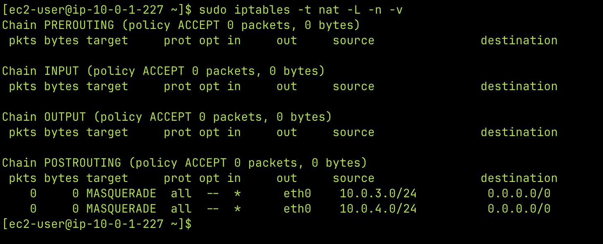
> Output de `iptables -t nat -L -n -v` mostrando la regla MASQUERADE.

### Cómo funciona el NAT — paquete por paquete

Para que entiendas exactamente qué pasa cuando una instancia privada hace `curl google.com`:

```
PAQUETE DE IDA:
  Instancia privada (10.0.3.10) quiere acceder a google.com (142.250.80.46)

  1. Paquete sale:        src=10.0.3.10    dst=142.250.80.46
  2. Route Table privada: 0.0.0.0/0 → NAT Instance → paquete llega a la NAT
  3. iptables MASQUERADE: src=10.0.3.10 → src=54.x.x.x (IP pública NAT)
  4. Sale por el IGW a internet

PAQUETE DE VUELTA:
  Google responde a 54.x.x.x (la IP pública de la NAT)

  5. Llega al IGW → NAT Instance
  6. conntrack recuerda: "54.x.x.x:44832 era 10.0.3.10:44832"
  7. Revierte:           dst=54.x.x.x → dst=10.0.3.10
  8. Paquete llega a la instancia privada

La instancia privada no sabe que hubo NAT — para ella, google le respondió directo.
```

!!! note "conntrack"
    `conntrack` es el módulo del kernel de Linux que recuerda las conexiones activas. Es lo que permite que el MASQUERADE sepa a quién devolverle la respuesta. Sin conntrack, la NAT no sabría que el paquete de vuelta de google era para `10.0.3.10`.

### 3.5 Ruta en la Route Table privada

Ahora le decimos a la Route Table privada: "para llegar a internet (`0.0.0.0/0`), mandá el tráfico a la NAT Instance". Sin esta ruta, los paquetes de las instancias privadas no tienen adónde ir.

=== "Consola AWS"

    1. Ir a **VPC** → **Route Tables** → seleccionar `d3lt4-private-rt`
    2. Pestaña **Routes** → **Edit routes** → **Add route**
        - Destination: `0.0.0.0/0`
        - Target: **Instance** → seleccionar `d3lt4-nat-instance`
    3. **Save changes**

    > 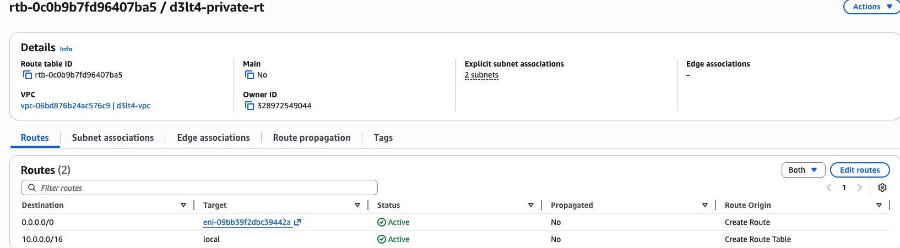
    > Route table privada con la ruta `0.0.0.0/0 → NAT Instance`.

    > 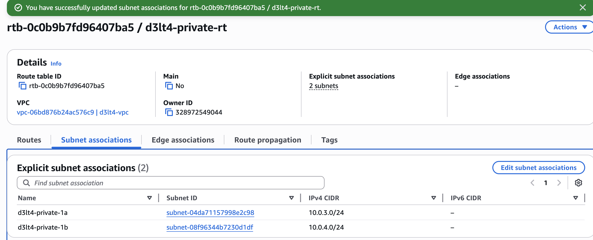
    > Subnet associations: las dos subnets privadas asociadas.

=== "CLI"

    ```bash
    aws ec2 create-route \
      --route-table-id $PRIVATE_RT \
      --destination-cidr-block 0.0.0.0/0 \
      --instance-id $NAT_INSTANCE_ID
    ```

### 3.6 Probar con una instancia privada

Ahora viene el momento de la verdad. Vamos a lanzar una EC2 en la subnet privada (sin IP pública) y verificar que puede salir a internet a través de la NAT Instance.

=== "Consola AWS"

    **Crear Security Group para la instancia privada:**

    1. **EC2** → **Security Groups** → **Create security group**
    2. Name: `d3lt4-private-sg`
    3. Description: `Instancia privada - SSH desde subnets publicas`
    4. VPC: `d3lt4-vpc`
    5. Inbound rules:

        | Type | Port | Source | Descripción |
        |------|------|--------|-------------|
        | SSH | 22 | `10.0.1.0/24` | SSH desde public-1a (NAT/bastion) |
        | SSH | 22 | `10.0.2.0/24` | SSH desde public-1b |

    6. **Create security group**

    > 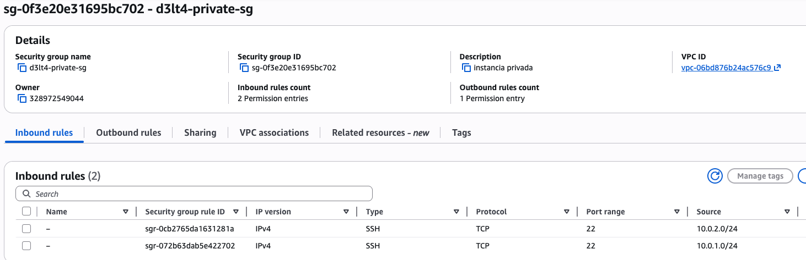
    > Security Group de la instancia privada — SSH solo desde las subnets públicas.

    **Lanzar instancia de test:**

    1. **EC2** → **Launch instances**
    2. Name: `d3lt4-private-test`
    3. AMI: **Amazon Linux 2**
    4. Instance type: `t2.micro`
    5. Key pair: `d3lt4-key`
    6. Network settings → Edit:
        - VPC: `d3lt4-vpc`
        - Subnet: `d3lt4-private-1a`
        - Auto-assign public IP: **Disable** (es privada, no queremos IP pública)
        - Select existing security group: `d3lt4-private-sg`
    7. **Launch instance**

    > 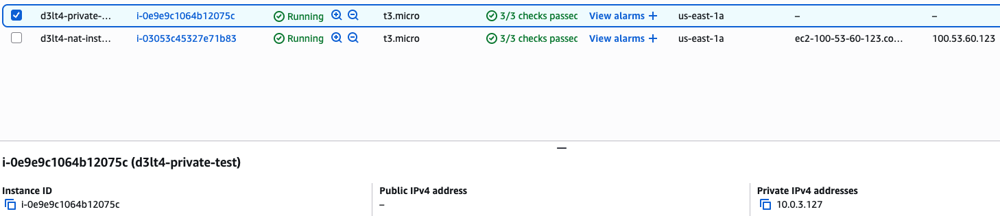
    > Instancia `d3lt4-private-test` en Running, sin IP pública, con Private IP `10.0.3.x`.

=== "CLI"

    ```bash
    aws ec2 create-security-group \
      --group-name d3lt4-private-sg \
      --description "Instancia privada - SSH desde subnets publicas" \
      --vpc-id $VPC_ID

    aws ec2 authorize-security-group-ingress \
      --group-id $PRIV_SG --protocol tcp --port 22 --cidr 10.0.1.0/24
    aws ec2 authorize-security-group-ingress \
      --group-id $PRIV_SG --protocol tcp --port 22 --cidr 10.0.2.0/24

    aws ec2 run-instances \
      --image-id ami-0c02fb55956c7d316 \
      --instance-type t2.micro \
      --subnet-id $PRIV_SUBNET_A \
      --security-group-ids $PRIV_SG \
      --key-name $KEY_PAIR \
      --tag-specifications 'ResourceType=instance,Tags=[{Key=Name,Value=d3lt4-private-test}]'
    ```

### Probar conectividad

La instancia privada no tiene IP pública, así que no podés conectarte directo. Usamos **SSH con ProxyCommand** — le decimos a SSH "conectate primero a la NAT Instance y desde ahí saltá a la privada":

```bash
ssh -o ProxyCommand="ssh -i d3lt4-key.pem -W %h:%p ec2-user@<IP_PUBLICA_NAT>" \
    -i d3lt4-key.pem \
    ec2-user@<IP_PRIVADA>
```

!!! info "Qué hace ProxyCommand"
    `-o ProxyCommand` le dice a SSH: "no te conectes directo al destino, primero establecé un túnel a través de este host intermedio". El flag `-W %h:%p` le indica al host intermedio que reenvíe la conexión al host y puerto de destino. La NAT Instance actúa como **bastion host** — un punto de entrada seguro a la red privada.

    Existe también el flag `-J` que es un shorthand más corto (`ssh -J ec2-user@<NAT> ec2-user@<PRIVADA>`), pero en la práctica puede no funcionar en todas las configuraciones. `ProxyCommand` es más explícito y confiable.

> 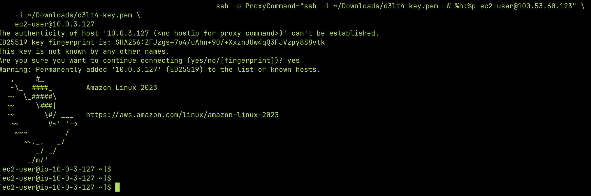
> SSH a la instancia privada pasando por la NAT como bastion.

Dentro de la instancia privada:

```bash
# Probar que llega a internet
ping -c 3 8.8.8.8

# Probar que resuelve DNS y baja contenido
curl -s https://google.com

# Esta es la prueba definitiva: debería mostrar la IP pública de la NAT Instance
# (no la de la instancia privada, porque no tiene)
curl -s ifconfig.me

# Probar que puede descargar paquetes
sudo yum check-update
```

> 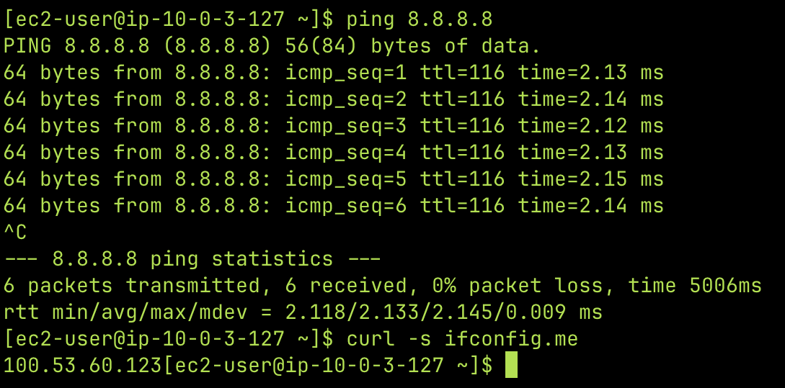
> Ping a `8.8.8.8` y `curl ifconfig.me` desde la instancia privada — muestra la IP pública de la NAT Instance, la prueba de que el NAT funciona.

### Bonus: Monitorear el NAT en vivo

Si querés ver el NAT en acción, abrí otra terminal, conectate a la NAT Instance y mirá el tráfico:

```bash
# En la NAT Instance:
sudo yum install -y conntrack-tools

# Ver conexiones NAT activas (muestra la traducción de IPs)
sudo conntrack -L

# Ver paquetes en tiempo real
sudo tcpdump -i ens5 -n host <IP_PRIVADA_INSTANCIA>
```

> 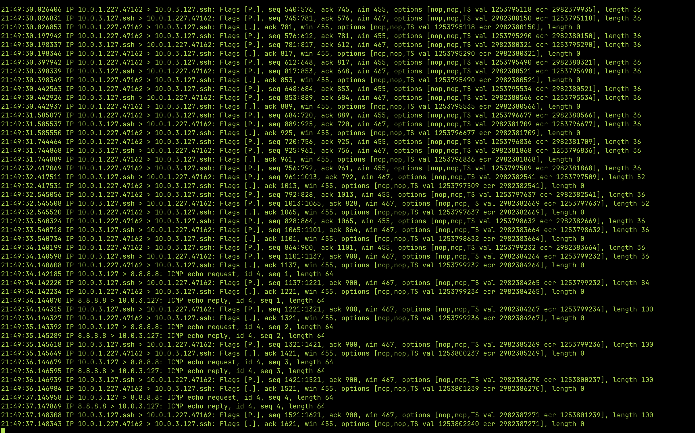
> Conexiones NAT activas mostrando la traducción de IPs.

### Verificación Parte 3

- [ ] Instancia privada puede hacer `ping 8.8.8.8`
- [ ] `curl ifconfig.me` desde la privada muestra la IP pública de la NAT (no la de la privada)
- [ ] `iptables -t nat -L -n -v` muestra paquetes contados en MASQUERADE

---

## Limpieza

La instancia privada de test ya no la necesitamos — solo la usamos para verificar que el NAT funciona.

=== "Consola AWS"

    1. Ir a **EC2** → **Instances**
    2. Seleccionar `d3lt4-private-test`
    3. **Instance state** → **Terminate instance** → Confirmar


=== "CLI"

    ```bash
    aws ec2 terminate-instances --instance-ids <PRIVATE_TEST_INSTANCE_ID>
    ```

!!! tip "Lo que dejamos corriendo (Free Tier)"
    - **VPC, subnets, IGW, Route Tables** → siempre gratis, no cobra nada
    - **EC2 web server (t2.micro)** → Free Tier, la usamos en el próximo lab
    - **NAT Instance (t2.micro)** → Free Tier, pero ojo: son 750 horas/mes **entre todas** las t2.micro. Si corrés 2 instancias 24/7 = 1,440 horas → te pasás del Free Tier. Pará la NAT cuando no practiques:

    **Consola:** EC2 → seleccionar `d3lt4-nat-instance` → Instance state → Stop instance

    **CLI:** `aws ec2 stop-instances --instance-ids $NAT_INSTANCE_ID`

---

## Resumen de conceptos clave

Lo que cubrimos en este lab:

| Concepto | Detalle |
|----------|---------|
| VPC | Vive en una **región**. Una subnet vive en una **AZ**. |
| Subnet pública vs privada | La diferencia es solo la Route Table: pública tiene ruta `0.0.0.0/0 → IGW`. |
| CIDR | `/16` = 65,536 IPs. `/24` = 256 IPs (251 usables, AWS reserva 5). |
| DNS hostnames | Necesario para que EC2 tengan DNS público. |
| User Data | Script que se ejecuta como root en el **primer boot** de la instancia. |
| IMDSv2 | Metadata Service v2, protege contra SSRF con un token. IP: `169.254.169.254`. |
| Familias EC2 | T (burstable), M (general), C (compute), R (memory), I/D (storage). |
| Source/Dest Check OFF | **Obligatorio** para cualquier instancia que haga de router, NAT o firewall. |
| NAT Instance vs NAT Gateway | Instance = manual y barato. Gateway = managed, caro, más rendimiento. |
| NAT Instance como bastion | Puede serlo (Gateway no puede). |
| Security Groups en NAT | Aplican a NAT Instance, **no** a NAT Gateway (que usa NACLs). |
| iptables | Firewall del kernel de Linux. Usa tablas (filter, nat) y cadenas de reglas para controlar el tráfico. |
| MASQUERADE | Regla de iptables (tabla nat) que reemplaza la IP origen por la de la interfaz de salida. |
| conntrack | Módulo del kernel que trackea conexiones para saber a quién devolver las respuestas del NAT. |
