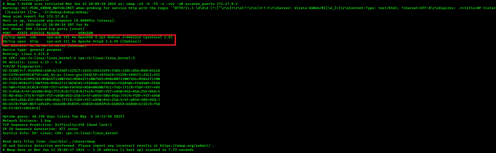
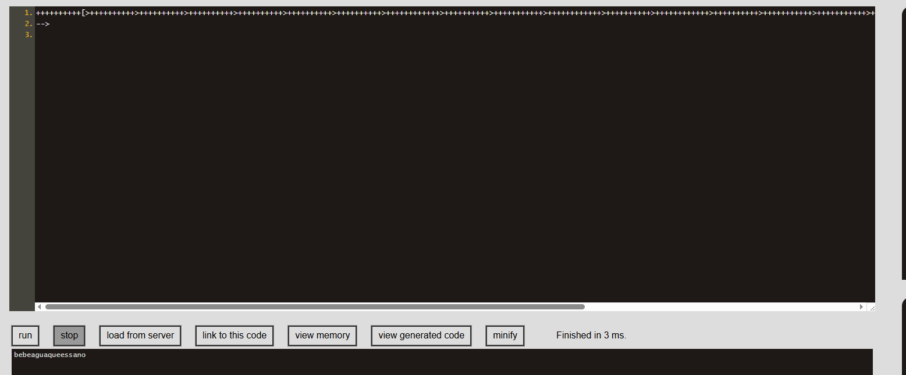
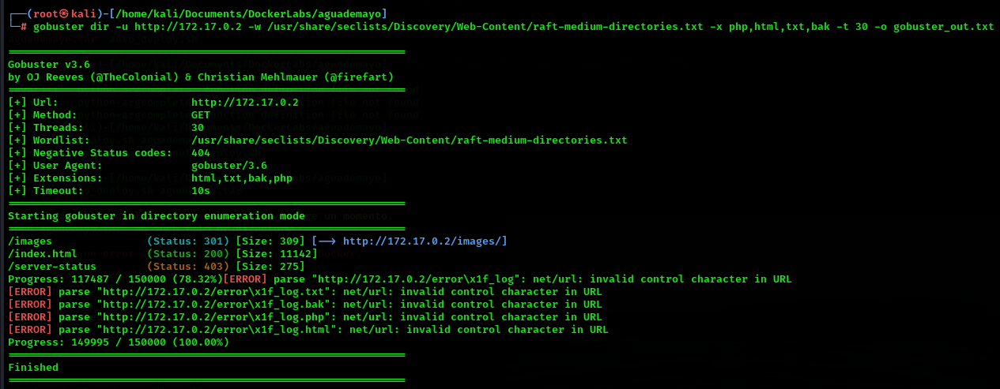
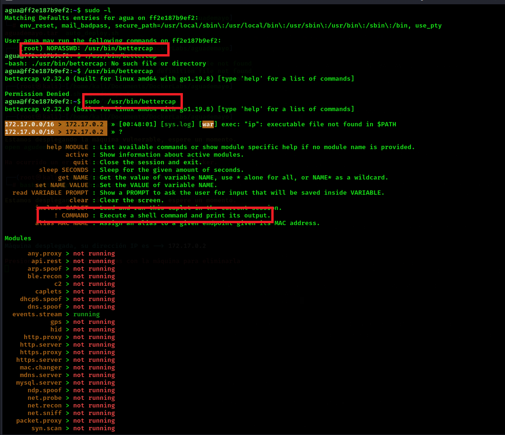
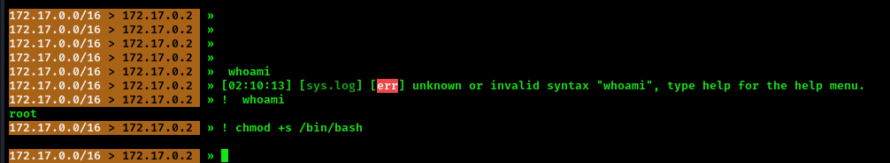
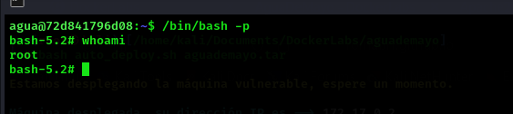

# Aguademayo 💧

## 1. Información general de la máquina

- **Dificultad**: Fácil
- **Puntos clave**: Enumeración web, extracción de datos ocultos, escalada de privilegios con bettercap.
- **Habilidades necesarias**: Conocimientos básicos de servicios web, análisis de código fuente y uso de herramientas de red.

## 2. Reconocimiento

Para comenzar, haremos un escaneo de puertos con **nmap** para identificar los servicios expuestos:

```bash
nmap -sV -O -T5 -n -vvv -oN escaneo_puerto 172.17.0.2
```

Explicación del comando:

- **`nmap`**: herramienta de escaneo de redes.
- **`-sV`**: detecta versiones de los servicios.
- **`-O`**: detecta sistema operativo.
- **`-T5`**: velocidad máxima de escaneo.
- **`-n`**: no realiza resolución DNS.
- **`-vvv`**: salida muy detallada.
- **`-oN escaneo_puerto`**: guarda el resultado en un archivo.



El escaneo revela:

- **22/tcp (SSH)**: OpenSSH 9.2p1 Debian
- **80/tcp (HTTP)**: Apache 2.4.56 (Debian)
- **SO detectado**: Linux 4.15 - 5.8

Una vez hecho esto pasamos a investigar un poquito mas en profundidad el servicio presentado en el puerto 80 **http**. Si investigamos un poco el codigo fuente, nos encontramos con un codigo en `brainfuck`

??? note "Brainfuck"
    Brainfuck es un lenguaje de programación esotérico y minimalista creado en 1993 por Urban Müller. Tiene solo 8 comandos y está diseñado para ser extremadamente difícil de leer y escribir, pero con la capacidad de implementar cualquier algoritmo. Se usa generalmente como desafío de lógica y para aprender manipulación de punteros y memoria.



## 3. Enumeración

Realizamos un fuzzing web con **gobuster** para descubrir directorios ocultos en el servidor:

```bash
gobuster dir -u http://172.17.0.2 -w /usr/share/seclists/Discovery/Web-Content/raft-medium-directories.txt -x php,html,txt,bak -t 30 -o gobuster_out.txt
```

Explicación del comando:

- **`gobuster`**: herramienta de enumeración de directorios.
- **`dir`**: modo de búsqueda de directorios.
- **`-u`**: URL objetivo.
- **`-w`**: wordlist utilizada para el ataque.
- **`-x`**: extensiones de archivos a buscar.
- **`-t 30`**: cantidad de threads.
- **`-o`**: salida a un archivo.



Resultados clave:

- `/images` → Redirección (301)
- `/index.html` → Página principal (200)
- `/server-status` → Prohibido (403)

Nada de lo aca encontrado es relevante para la explotacion, por ende pasamos al siguiente punto.

## 4. Explotación

Durante la inspección del código fuente de la página principal, encontramos dentro del cosdigo fuente un codigo que logramos decodificar en brainfuck el texto contenia lo siguiente:

```txt
bebeaguaqueessano
```

> **¿Qué significa esto?** Posiblemente sea una contraseña para un usuario más adelante.

La mejor manera de probar esto, es intentar loguearse via **`SSH`**, servicio presentado en el puerto numero 22. Ingresaremos con el usuario `agua` y la contraseña `bebeaguaqueessano`.

## 5. Escalada de privilegios

Accedimos con el usuario `agua` y al ejecutar **sudo -l** encontramos que puede ejecutar **bettercap** como root sin necesidad de contraseña.

```bash
sudo -l
```

Salida:

```bash
(ALL) NOPASSWD: /usr/bin/bettercap
```

??? note "¿Porque ejecutamos sudo -l?"
    El comando sudo -l lista los comandos que un usuario puede ejecutar con permisos de root. Se usa para buscar posibles caminos de escalada de privilegios, ya que si un usuario puede ejecutar algún binario como root, podrías usarlo para obtener acceso total al sistema.

Ejecutamos bettercap:

```bash
sudo /usr/bin/bettercap
```



Dentro de bettercap, probamos si realmente teníamos permisos de root usando ! whoami (el ! permite ejecutar comandos del sistema desde la consola de bettercap) y efectivamente nos devolvió root.

Luego, ejecutamos

```bash
 chmod +s /bin/bash 
```
 Esto nos permite agregar el bit SUID a bash para, más adelante, obtener una shell como root simplemente ejecutando bash.



Ahora simplemente tenemos que salir de `bettercap` volver a nuestra shell y correr el binario con el bit **`SUID`**.

??? note "Bit SUID"
    El bit SUID es un permiso especial en archivos ejecutables que hace que el programa se ejecute con los privilegios de su propietario (normalmente root), sin importar qué usuario lo ejecute. Es útil para comandos que necesitan permisos elevados, pero si se usa mal puede permitir escaladas de privilegios

Solamente ejecutaremos

```bash
/bin/bash -p 
```

- **`-p`**: Esta flag le indica al daemon que tiene que ejecutar el bit SUID.



Y eso es todo ahora somos **`root`**

## 6. Captura de Bandera

Esta máquina no contiene bandera para capturar.

## 7. Lecciones Aprendidas

- La importancia de revisar el **código fuente** de los sitios web. A simple vista pueden no mostrar nada, pero ocultar datos clave en comentarios o códigos como Brainfuck.
- Conocer **lenguajes esotéricos** como Brainfuck puede ayudarte a resolver desafíos donde la información está ofuscada.
- Usar herramientas como **Gobuster** siempre es buena práctica para enumerar directorios, aunque en este caso no hayan aportado información útil.
- Ejecutar **`sudo -l`** es un paso clave para identificar posibles caminos de escalada de privilegios en un sistema comprometido.
- Permitir a un usuario ejecutar herramientas como **Bettercap con sudo sin contraseña** es un riesgo crítico, ya que facilita la escalada a root sin barreras.
- Entender el uso del **bit SUID** y la flag `-p` de bash permite explotar rápidamente escaladas de privilegios y consolidar el acceso como root.
- Este ejercicio refuerza la importancia de **configurar correctamente permisos y sudoers**, y de auditar regularmente los binarios que pueden ser ejecutados como root por usuarios comunes.
