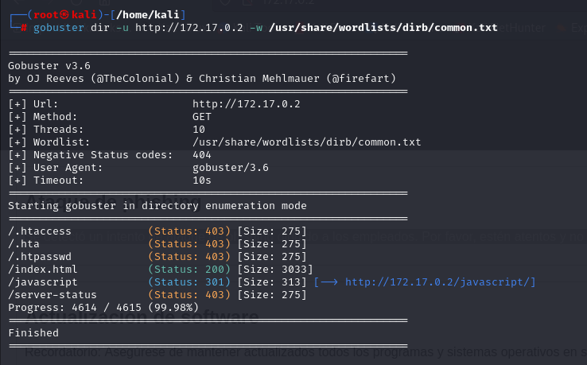
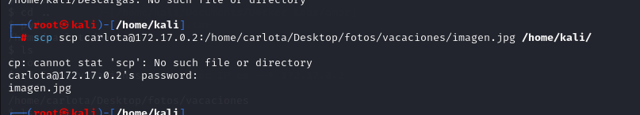
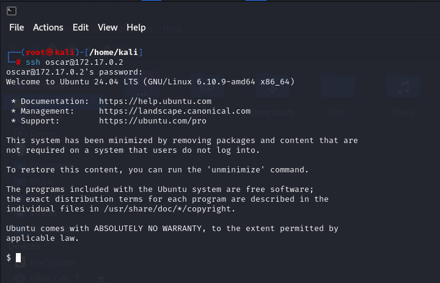

# Amor ❤️

## 1. Información general de la máquina

- **Dificultad**: Fácil
- **Puntos clave**: Esteganografia, Escalada de privilegios, Ataque de fuerza bruta a ssh.
- **Habilidades necesarias**: Conocimientos de protocolos de red, uso de herramientas da hacking etico y criptografia basica.

## 2. Reconocimiento

El primer paso es acceder a la máquina virtual a través de la interfaz de línea de comandos proporcionada por Kali Linux. La dirección IP de la máquina objetivo es 172.17.0.2.
Al intentar ingresar por navegador a dicha direccion, vemos lo siguiente


Lo que podemos inferir de este paso, es que  hay dos probables nombres de usuarios para un ingreso a algun tipo de servicio **carlota** y **juan**

## 3. Enumeración

Utilizamos Nmap para escanear los puertos abiertos y detectar vulnerabilidades en la máquina objetivo:

```bash
nmap -n -vvv -sS --max-rate 50 -f -sV 172.17.0.2
```

Explicación del comando

- **`nmap`**: Herramienta de escaneo de redes.
- **`-sS`**: Realiza un escaneo SYN (stealth), que es menos detectable.
- **`-vvv`**: Muestra información detallada del escaneo.
- **`-n`**: No hace resolucion de DNS.
- **`--max-rate 50`**:  Envia un maximo de 50 paquetes por segundo.
- **`-f`**: Habilita la fragmentacion de paquetes.
- **`-sV`**: Busca servicios asociados a puertos y sus versiones.
- **`172.17.0.2`**: Dirección IP del objetivo a escanear.


El escaneo revela que hay dos puertos abiertos, el puerto **`80`** (puerto con servicio http, donde esta la pagina web) y el puerto **`22`** (puerto con servicio de ssh).

Procederemos tambien a hacer un fuzzing web, para ver si hay algun directorio dentro de la apgina web para verificar que no nos estemos pasando por alto nada. Para esto usaremos la herramienta de **`gobuster`**

```bash
gobuster dir -u http://172.17.0.2 -w /usr/share/wordlists/dirb/common.txt
```

Explicación del comando

- **`gobuster`**: Herramienta de escaneo de redes.
- **`dir`**: Realiza un escaneo SYN (stealth), que es menos detectable.
- **`-u`**: Flag para indicar el 
- **`http://172.17.0.2`**:Direccion ip del objetivo.
- **`-w`**:Indicamos que haremos la busqueda con una wordlist (diccionario).
- **`/usr/share/wordlists/dirb/common.txt`**: la direccion donde esta almacenado el diccionario 



## 4. Explotación

Intentaremos hacer un ataque de fuerza bruta para intentar loguearnos como **carlota** via ssh. Usaremos **`hydra`** para realizar este ataque.

```bash
hydra -l carlota -P rockyou.txt -v 172.17.0.2 ssh -t 4
```
Explicación del comando

- **`hydra`**:Herramienta para realizar ataques de fuerza bruta
- **`-l carlota`**: Indicamos con que nombre de usuario queremos loguearnos para realizar el ataque en cuestion. 
- **`-P rockyou.txt`**: Al colocar la bandera p en mayuscula estamos indicando al programa que realize el ataque con mas de una contraseña, y le indicamos la ruta al diccionario en cuestion. 
- **`-v 172.17.0.2 `**: Indicamos la direcion ip donde haremos el ataque. 
- **`ssh`**: Al colocar ssh, estamos indicando el puerto en el cual esta el servicio que queremos ataca (22 es el default de ssh), pero podriamos indicar otro puerto tranquilamente.
- **`-t 4`**: Indicamos el paralelismo de los ataques. 

Carlota era un usuario efectivamente, y nos da la contraseña para acceder a ssh con su usuario **`babygirl`**


Nos logueamos efectivamente con usuario y contraseña, y dentro del usuario nos encontramos que hay un directorio dentro del escritorio (fotos/vacaciones/) el cual contiene una imagen.


**¿Escondera algo esta imagen?** La descargamos a nuestra maquina para hacerle tratamientos de metadatos y esteganografia, la descarga la haremos usando la herramienta **`scp`**

```bash
scp carlota@172.17.0.2:/home/carlota/Desktop/fotos/vacaciones/imagen.jpg /home/kali
```

Explicación del comando

- **`scp`**: Herramienta para descarga via ssh.
- **`carlota@172.17.0.2:/home/carlota/Desktop/fotos/vacaciones/imagen.jpg`**: Logueo via ssh e indicamos la ruta de lo que queremos descargar
- **`/home/kali`**: Ruta local donde vamos a almcaenar la imagen. 



El proximo paso sera pasar dicha imagen por una proceso de obtención de metadatos y otro de esteganografia.

 > Si no sabes lo que es la esteganografia te dejo un [link](https://www.kaspersky.es/blog/digital-steganography/18791/) para que puedas entender mejor lo que estamos haciendo.

Para esto usaremos la herramienta **`steghide`**

```bash
steghide extract -sF imagen.jpg
```

Explicación del comando

- **`steghide`**:Herramienta de esteganografia.
- **`extract`**: Indicamos que quermos extraer de la imagen algun secreto (si es que lo hay).
- **`-sF`**: Con estod indicamos que el siguiente comando sera la imagen.

En el directorio en el cual estamos parados, se va a crear un archivo **`secret.txt`** conteniendo el secreto que haya encontrado la herramiento


Parece que estuviese cifrado, no?. Probemos decodificarlo con **`base64`** a ver que nos devuelve

```bash
base64 -d secret.txt
```
Explicación del comando

- **`base64`**: Herramienta para cifrar/descifrar en base64.
- **`-d`**: Indicamos que decifre.
- **`secret.txt`**: Archivo a descifrar.


Luego del tratamiento de metadatos de la imagen , encontramos que el propietario de la misma es **oscar**, por lo que intetaremos ingresar via ssh con ese usuario y la contraseña que obtuvimos del proceso de esteganografia.



Efectivamente era la contraseña del usuario **oscar**

## 5. Escalada de privilegios

Una vez logueados como **oscar**, haremos una prueba inicial usando el comando **`sudo -l`**, para verificar si hay algo que podamos ejecutar con permisos de root.

Encontramos que el usuario oscar puede ejecutar el binario **`/usr/bin/ruby`**, por lo que procederemos a buscar e la herramienta searchbibins como podemos explotar este binario para realizar la escalda de privileggios.

> Te dejo [aca](https://github.com/r1vs3c/searchbins) el link para descargar la herramienta.


Probamos si haciendo la ejecucion del exploit, realizamos la escalda de privilegio.


¡Y listo! Ya somos el usuario **`root`**.

## 6. Captura de Bandera

Esta Maquina Vulnerable no cuenta con captura de bandera.

## 7. Lecciones Aprendidas

- La importancia de proteger los servicios críticos como SSH con contraseñas robustas y desactivar usuarios no necesarios.
- Cómo realizar ataques de fuerza bruta puede llevar a comprometer servicios cuando no hay medidas de seguridad adecuadas.
- El valor de herramientas como Steghide para descubrir información oculta en archivos que, a simple vista, parecen inofensivos.
- La importancia de revisar permisos especiales otorgados a usuarios dentro del sistema, que pueden ser usados para escalar privilegios (en este caso, la capacidad de ejecutar scripts Ruby como root).

Este ejercicio refuerza la importancia de la auditoría de seguridad continua y la aplicación de políticas de contraseñas fuertes y encriptación.