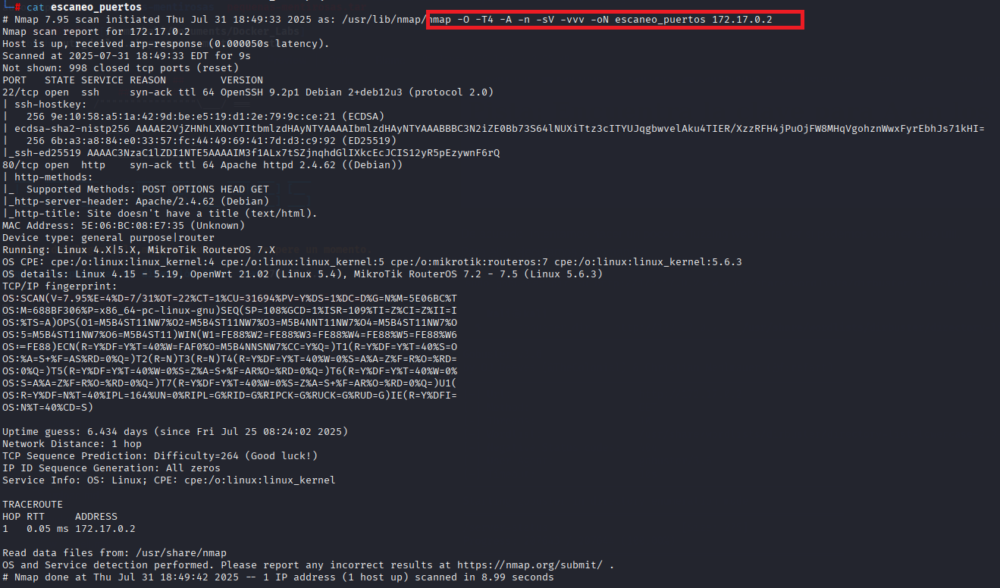
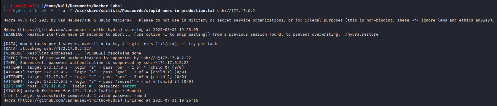

# Pequeñas Mentirosas 🎭

## 1. Información general de la máquina

- **Dificultad**: Fácil
- **Puntos clave**: Enumeración web, extracción de datos ocultos, escalada de privilegios con binarios comunes.
- **Habilidades necesarias**: Conocimientos básicos de servicios web, análisis de código fuente y uso de herramientas de red.

## 2. Reconocimiento

Para comenzar, haremos un escaneo de puertos con **nmap** para identificar los servicios expuestos:

```bash
nmap -sV -O -T4 -n -A -vvv -oN escaneo_puertos 172.17.0.2
```

Explicación del comando:

- **`nmap`**: herramienta de escaneo de redes.
- **`-sV`**: detecta versiones de los servicios.
- **`-O`**: detecta sistema operativo.
- **`-T4`**: velocidad alta de escaneo.
- **`-n`**: no realiza resolución DNS.
- **`-A`**: serie de scripts avanzados.
- **`-vvv`**: salida muy detallada.
- **`-oN escaneo_puerto`**: guarda el resultado en un archivo.



El escaneo revela:

- **22/tcp (SSH)**: OpenSSH 9.2
- **80/tcp (HTTP)**: Apache 2.4.62 (Debian)

Una vez hecho esto procedemos a ingresar via navegador web a ver que nos muuestra la pagina web


Aca luego de tardar mucho tiempo, intenando ver si tenia alguna query escondida e intentar tambien enumarar endpoints utilizando **`gobuster`** sin tener ningun tipo de exito se me ocurrio que quizas A sea un nombre de usuario al cual se le pueda hacer un ataque de fuerza brutai al purerto 22 que presenta un ssh

## 3. Enumeración

Como mencione anteriormente en la etapa de enumeracion no se encontro casi nada de las paginas web

## 4. Explotación

Procedemos a utilizar la herramienta `hydra`, la cual es una herramienta muy conocida para realizar ataques de fuerza bruta, para lo que tendremos que tener un diccionario de contraseñas para que la herramienta haga la prueba, yo en mi caso utilize un diccionario de `seclists`, si te interesa descargarlos podes ir [aca](https://github.com/danielmiessler/SecLists)

```bash
hydra -t 4 -vv -l a -P <ruta al diccionario> ssh://172.17.0.2 
```
Explicación del comando:

- **`hydra`**: herramienta para ataques de fuerza bruta
- **`-t 4`**: cantidad de hilos que se van a utilizar al mismo tiempo
- **`-vv`**: nivel de verbosidad
- **`-l a`**: nombre de usuario con el que va a realizar el ataque de fuerza bruta
- **`-P`**: diccionario o lista de contraseñas con las que va a realizar el ataque de fuerza bruta



Descubrimos la contraseña, ahora solamente debemos loguearnos via ssh

## 5. Escalada de privilegios

Una vez adentro intentamos correr el comando de `sudo -l` sin tener exito, entonces como haremos para realizar la escalada de privilegios, si recordamos lo que se veia al entrar al navegador web nombraba que la clave de a estaba en "los archivos", dicho esto procedemos a ir a la raiz de la carpeta de este servidor a ver si encontramos algo que nos sirva


Si entramos a la carpeta srv (Service) encontraremos un archivo que contiene la clave de spencer pero en formato de hash **`md5`**, como todos sabemos el proceso de hash es irreversible, pero se puede realizar un crackeo de este hash, para esto usaremos una herramienta muy famosa llamada **`hashcat`**

??? note "Hashcat"
    Hashcat es una herramienta de recuperación de contraseñas que utiliza técnicas de fuerza bruta y ataques por diccionario para descifrar hashes. Es conocida por su alta velocidad y compatibilidad con GPU, lo que la hace ideal para auditorías de seguridad y pruebas de fortaleza de contraseñas.

Primero, se debe ejecutar Hashcat con los parámetros correctos para iniciar el proceso de crackeo.

```bash
hashcat -m 0 -a 0 <hash o archivo de hash>  <diccionario>
```
Explicación del comando:

- **`hashcat`**: herramienta de crackeo de contraseñas
- **`-m 0`**: Tipo de hash, si queres saber que tipos hay corre hashcat -h
- **`-a 0`**: Modo diccionario


De la misma manera que la ultima vez nos logueamos via ssh pero esta vez como el usuario **`spencer`** y la contraseña que recien crackeamos

Una vez logueados, como hacemos siempre correremos el comando de **`sudo -l`**, veremos que podemos correr el binario de `python3` como si fueramos root, nos vamos a buscar el exploit para escalar privilegios de python3 y simplemente lo ejecutamos


Y finalmente somos `root`.
## 6. Captura de Bandera

Esta máquina no contiene bandera para capturar.

## 7. Lecciones Aprendidas

- La falta de contenido aparente en una web no implica que no contenga información útil: las pistas textuales pueden ser claves para comenzar un ataque.

- Permitir accesos SSH sin limitar intentos de login ni aplicar contraseñas robustas puede exponer gravemente el sistema frente a ataques de fuerza bruta.

- Almacenar hashes de contraseñas en directorios accesibles por usuarios comunes representa un riesgo serio si no se aplican mecanismos adecuados de protección.

- La posibilidad de ejecutar binarios como Python con permisos elevados (sin contraseña) convierte una mala configuración de sudoers en un acceso root garantizado.

- La combinación de errores menores (pistas expuestas, contraseñas débiles, binarios inseguros) puede llevar a una escalada completa sin necesidad de exploits sofisticados.