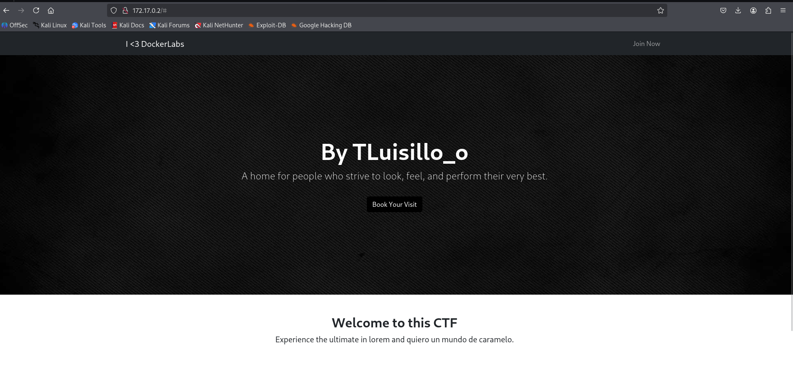
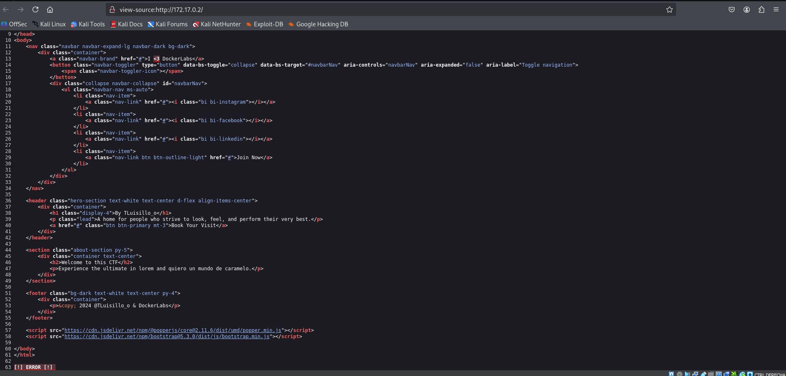
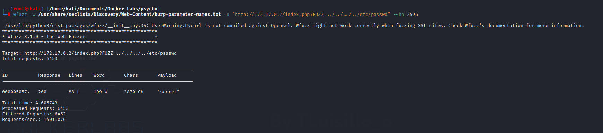
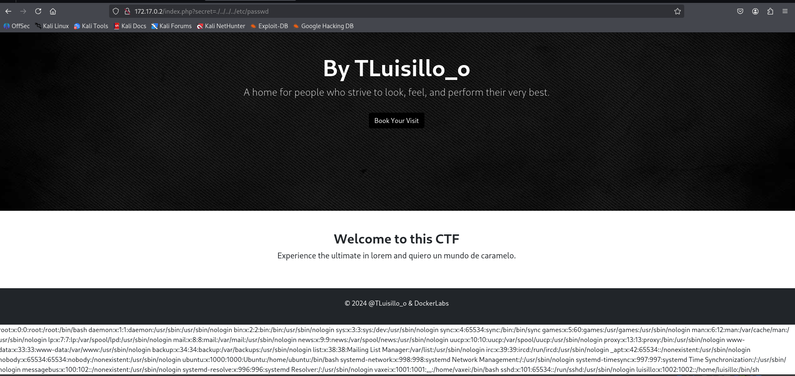
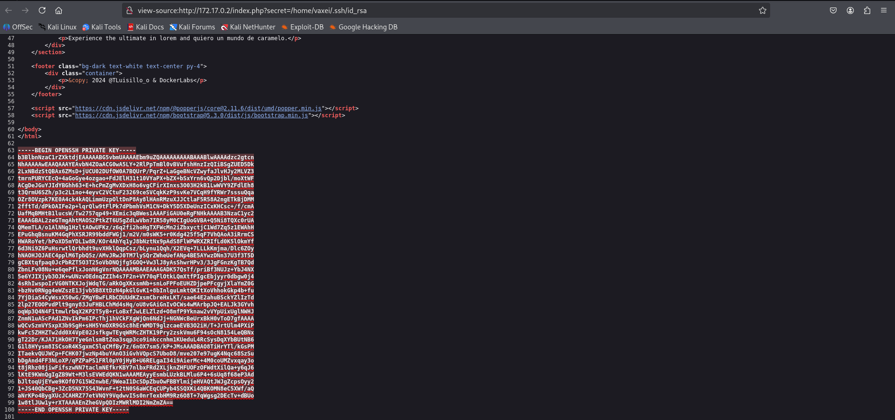
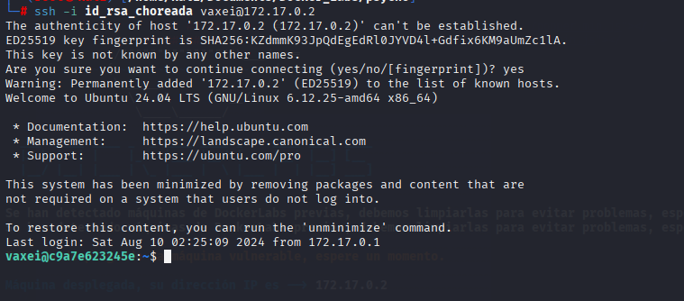
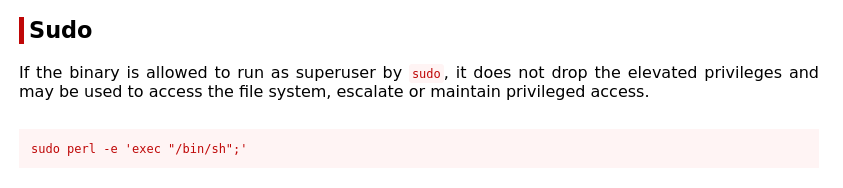
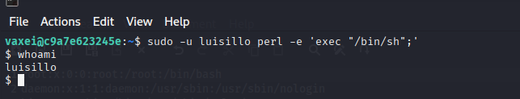
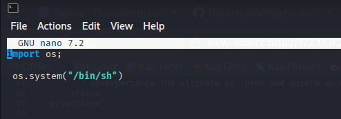
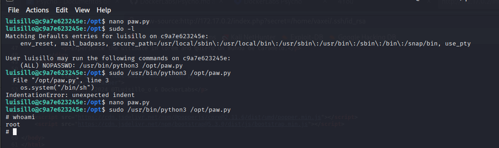

# Psycho 🪓

## 1. Información general de la máquina

- **Dificultad**: Fácil
- **Puntos clave**: Detección de LFI, uso indebido de claves privadas SSH, escalada de privilegios por permisos inseguros y configuración errónea de sudoers
- **Habilidades necesarias**: Conocimientos básicos de vulnerabilidades web, análisis de código fuente, navegación por el sistema de archivos en Linux y comprensión de permisos y escalada de privilegios.

## 2. Reconocimiento

Para comenzar, haremos un escaneo de puertos con **nmap** para identificar los servicios expuestos:

```bash
nmap -sV -O -T4 -n -A -vvv -oN escaneo_puertos 172.17.0.2
```

Explicación del comando:

- **`nmap`**: herramienta de escaneo de redes.
- **`-sV`**: detecta versiones de los servicios.
- **`-O`**: detecta sistema operativo.
- **`-T4`**: velocidad alta de escaneo.
- **`-n`**: no realiza resolución DNS.
- **`-A`**: serie de scripts avanzados.
- **`-vvv`**: salida muy detallada.
- **`-oN escaneo_puerto`**: guarda el resultado en un archivo.

El escaneo revela:

- **22/tcp (SSH)**
- **80/tcp (HTTP)**

Una vez hecho esto procedemos a ingresar via navegador web a ver que nos muuestra la pagina web



Una vez que abrimos la fuente del codigo encontre que al final habia un mensaje `!!Error!!` que me llamo mucho la atencion.



## 3. Enumeración

Luego de estar un buen rato enumerando endpoints http sin tener ningun tipo de exito utilizando `gobuster`, se me ocurrio que quizas haya una queri escondida en el archivo `index.php` por lo que decidi probar este aproximamiento usando la herramienta `wfuzz`

```bash
wfuzz -w <diccionario a usar> -u "http://172.17.0.2/index.php?FUZZ=../../../../etc/passwd" --hh 2596
```

Explicación del comando:

- **`wfuzz`**: herramienta para fuzzing de parámetros HTTP, útil para descubrir rutas, archivos o inyecciones.
- **`-w <diccionario>`**: archivo de diccionario a usar (una lista de posibles inyecciones o nombres de archivo).
- **`-u <url>`**: URL objetivo donde se coloca FUZZ como marcador de posición que wfuzz reemplazará por cada entrada del diccionario
- **`--hh 2596`**: oculta las respuestas que tengan una longitud de 2596 caracteres, útil para filtrar resultados que no cambian y resaltar posibles descubrimientos.

Este comando intenta descubrir si el sitio web tiene una query vulnerable a `LFI` (Local File Inclusion), es decir, si alguno de los parámetros que acepta la URL (como ?page= o similares) permite al atacante incluir archivos locales del sistema.

El uso del marcador FUZZ le indica a wfuzz que va a probar múltiples nombres de parámetros (como page, view, file, etc.) extraídos de un diccionario. A cada uno de esos parámetros le asigna como valor una ruta que apunta al archivo /etc/passwd, usando path traversal (../../..) para escapar del directorio web y acceder al sistema de archivos raíz.

El objetivo es encontrar si existe una query válida y vulnerable al mismo tiempo, lo cual permitiría leer archivos sensibles del sistema.



??? "LFI VS RCE"
    - LFI (Local File Inclusion): Permite leer archivos locales del servidor a través de parámetros manipulados. **`NO`** ejecuta codigo
    - RCE (Remote Code Execution): Permite ejecutar código arbitrario en el servidor, lo cual tiene un impacto mucho mayor

Probamos esta querie dentro del navegador y , sin ser magia, obtenemos la lista de usuarios perteneciente a este servidor



Tenemos dos usuarios que tiene una shell hablitada (sin contar a root), es decir no son cuentas de servicio, siendo los mismos `vaxei` y `luisillo`

## 4. Explotación

Luego de casi rendirme intentando ataques de fuerza bruta sobre los usuarios `luisillo` y `vaxei`, se me ocurrió que, dado que el otro puerto abierto era SSH, quizás alguno de estos usuarios tuviera su clave privada almacenada en su directorio personal.

Para quien no lo sepa, cada usuario en sistemas Linux suele tener un directorio oculto llamado ~/.ssh  que contiene archivos relacionados con la autenticación SSH, como:

- **`id_rsa`**: clave privada

- **`id_rsa.pub`**: clave pública

- **`authorized_keys`**: claves públicas autorizadas para ingresar

Siguiendo esta línea de pensamiento, revisé ambos perfiles. El usuario `luisillo` no tenía la clave privada, pero el usuario `vaxei` sí lo tenía, lo que permitió acceder directamente por SSH sin necesidad de crackear la contraseña.



??? note "Clave publica y Clave privada"
    El sistema de clave pública y privada es un método de cifrado asimétrico donde se generan dos claves: una pública, que puede compartirse libremente, y una privada, que debe mantenerse en secreto. Lo que se cifra con una clave solo puede ser descifrado con la otra.

Ahora solo tenemos que copiar la clave privada que encontramos y loguearnos via ssh utilizando esta clave.

```bash
ssh -i <archivo con clave priv> usuario@ip
```
Explicación del comando:

- **`ssh`**: herramienta para loguearme usando el servicio de ssh
- **`-i <archivo>`**: Le indico al servicio que voy a utilizar mi clave privada para loguearme.



## 5. Escalada de privilegios
Al ejecutar el comando `sudo -l` vemos que el usuario vaxei puede correr el binario de `perl` como si fuera el usuario `luisillo`, buscamos el exploit de este binario 



Y lo explotamos 



Ahora una vez que somos el usuario `luisillo` y corremos el comando `sudo -l` nos damos cuenta que solo podemos correr el binario `python3` como root pero solo si lo aplicamos a determinado archivo.

Al ejecutar el binario en el archivo en cuestion encuentro que habia un error en el codigo y me devolvia error, pero este arhivo podia ser modificado y/o borrado por cualquier persona, por lo que decidi borrarlo y crear uno nuevo con el exploit del binario `python3`





Y listo ahora somos `root`

## 6. Captura de Bandera

Esta máquina no contiene bandera para capturar.

## 7. Lecciones Aprendidas

- Nunca se deben dejar claves privadas almacenadas en directorios accesibles, especialmente dentro de ~/.ssh sin restricciones de permisos. Estas claves deben estar protegidas por permisos estrictos (chmod 600) y monitoreadas.

- Los parámetros de las aplicaciones web deben ser validados correctamente para evitar vulnerabilidades como LFI. Usar rutas dinámicas sin sanitización puede permitir la lectura de archivos críticos del sistema.

- Los archivos ejecutables que pueden ser corridos con sudo deben estar protegidos contra escritura. Permitir que cualquier usuario los modifique abre la puerta a la ejecución de código arbitrario como root.

- El uso de sudo para ejecutar binarios como otros usuarios sin autenticación debe evitarse, salvo en casos justificados y bajo un control estricto. Cada delegación debe ser revisada con la regla de mínimo privilegio.

- El contenido de scripts utilizados por sudo debe validarse y auditarse regularmente, ya que errores en su lógica o falta de validación pueden permitir la sustitución del archivo para ejecutar código malicioso.

- Es fundamental revisar y restringir los permisos de archivos sensibles, asegurando que solo el propietario o un grupo específico pueda modificarlos, especialmente cuando están implicados en flujos con privilegios elevados.