# Instalación y Configuración de Active Directory en Windows Server 🖥️🔐

En este artículo, te guiaré paso a paso para instalar y configurar **Active Directory (AD)** en un servidor Windows Server. Además, explicaré la estructura de AD (bosques, dominios, árboles, etc.), cómo crear usuarios en el dominio, cómo unir una máquina virtual con Windows 10 al dominio, y cómo mejorar la seguridad creando un nuevo usuario administrador y deshabilitando la cuenta de administrador predeterminada.

---

## ¿Qué es Active Directory?

Active Directory es un servicio de directorio desarrollado por Microsoft que se utiliza para gestionar usuarios, equipos, permisos y otros recursos en una red. Es una herramienta esencial en entornos empresariales, ya que permite centralizar la administración de la red y mejorar la seguridad.

### Estructura de Active Directory

1. **Bosque (Forest)**: Es el contenedor más grande en AD. Un bosque puede contener múltiples dominios y define un límite de seguridad. Todos los dominios dentro de un bosque comparten un esquema común, un catálogo global y una relación de confianza bidireccional.

2. **Dominio (Domain)**: Es una agrupación lógica de objetos (usuarios, equipos, grupos, etc.) que comparten una misma base de datos de directorio y políticas de seguridad. Cada dominio tiene un nombre único (por ejemplo, `empresa.com`).

3. **Árbol (Tree)**: Es una colección de dominios que comparten un espacio de nombres contiguo. Por ejemplo, si tenes un dominio principal `empresa.com`, un subdominio `sucursal.empresa.com` formaría parte del mismo árbol.

4. **Unidades Organizativas (OU)**: Son contenedores dentro de un dominio que se utilizan para organizar objetos (usuarios, equipos, etc.) y aplicar políticas de grupo (GPO) de manera más granular.

5. **Objetos**: Son los elementos que se gestionan en AD, como usuarios, equipos, grupos y recursos compartidos.

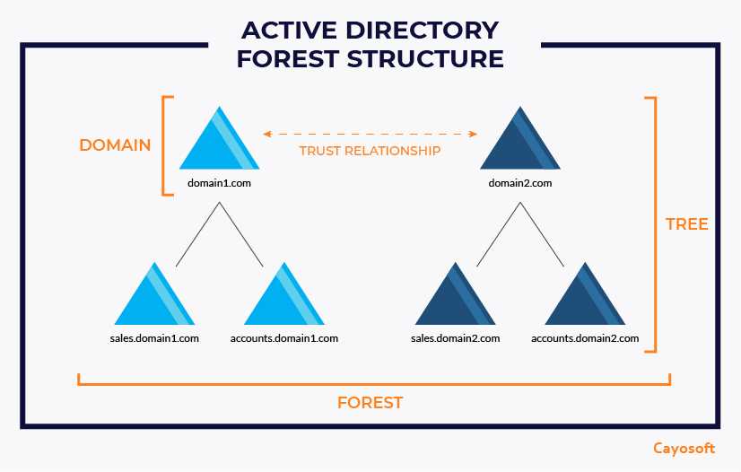

---

## Instalación de Active Directory en Windows Server

### Requisitos Previos
- Un servidor con Windows Server (2016, 2019 o 2022).
- Una dirección IP estática configurada en el servidor.
- Acceso de administrador al servidor.

### Paso 1: Instalar el Rol de Active Directory

1. Abri el **Administrador del Servidor** desde el menú Inicio.
2. Clic en **Agregar roles y características**.
    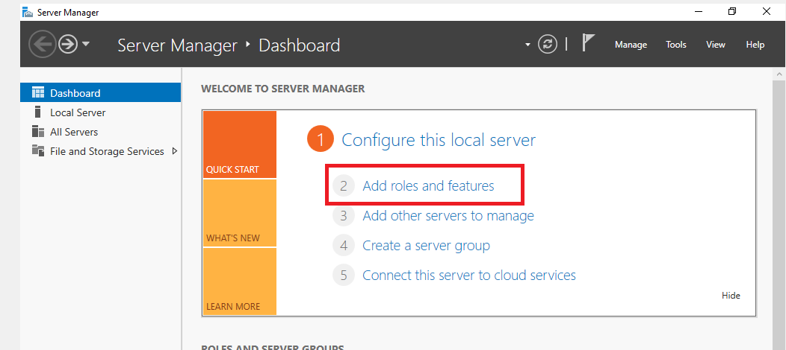
3. En el asistente, elegi **Instalación basada en roles o características** y clic en **Siguiente**.
    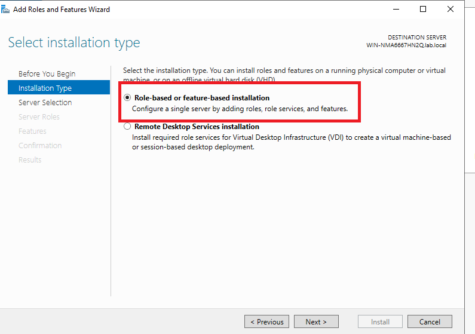
4. Selecciona el servidor en el que deseas instalar AD y haz clic en **Siguiente**.
    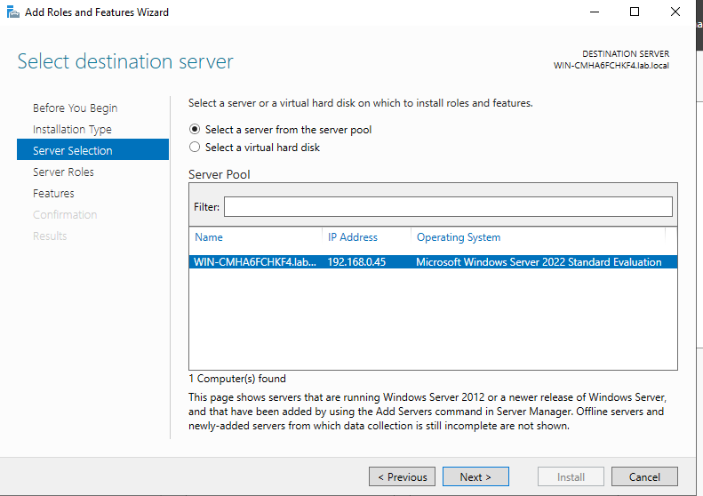
5. En la lista de roles, marca **Servicios de dominio de Active Directory**.
    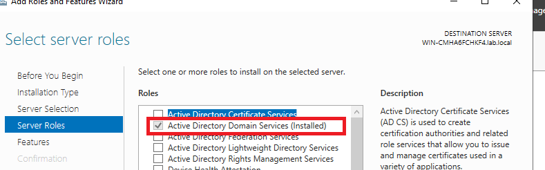
6. Clic en **Agregar características** cuando te lo solicite y luego en **Siguiente**.
7. Completa el asistente y clic en **Instalar**.
    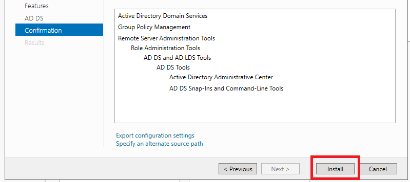

### Paso 2: Promover el Servidor a Controlador de Dominio

1. Cuando termine de instalarse, vas a ver un link de color azul **Promover este servidor a controlador de dominio**, clic ahi.
    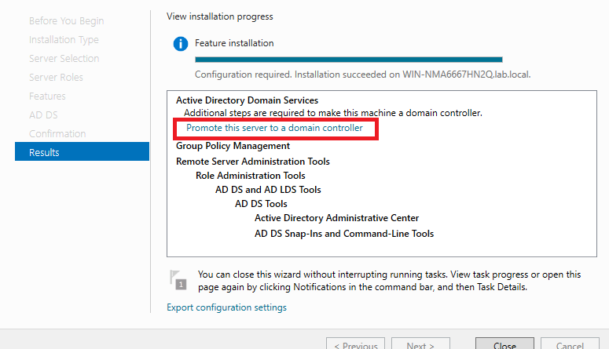
2. En el asistente, selecciona **Agregar un nuevo bosque** y escribe el nombre del dominio raíz (por ejemplo, `lab.local`).
    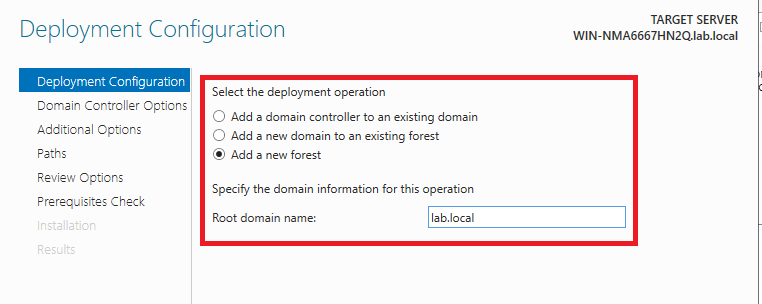
3. Configura las opciones de nivel funcional del bosque y del dominio.
4. Completa el asistente y haz clic en **Instalar**. El servidor se reiniciará nuevamente.
    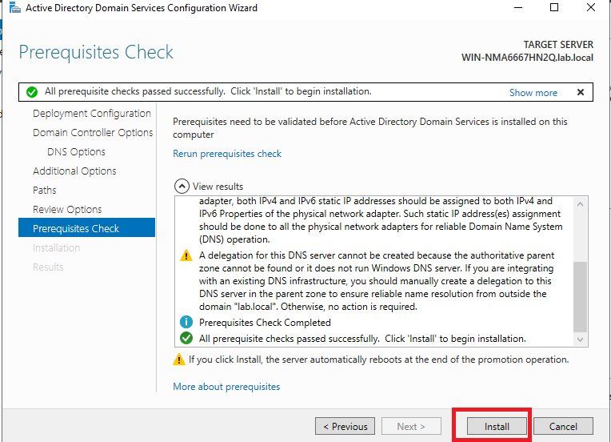
    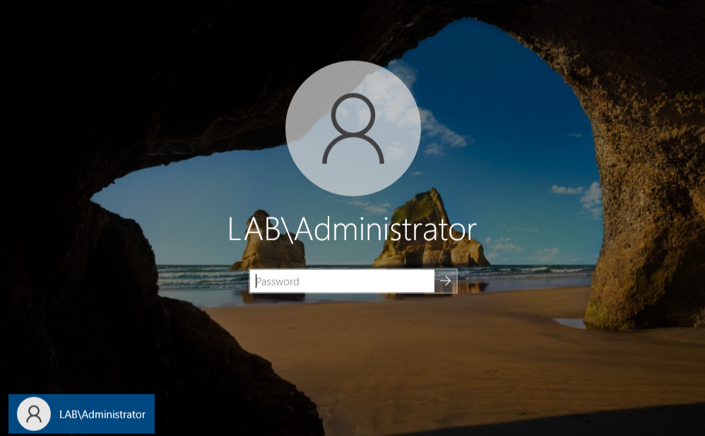

<!-- ---

## Creación de Usuarios en el Dominio

1. Abre **Usuarios y equipos de Active Directory** desde el menú Inicio o desde el **Administrador del Servidor**.
2. Navega hasta la **Unidad Organizativa (OU)** donde deseas crear el usuario (por ejemplo, `Usuarios`).
3. Haz clic derecho en la OU y selecciona **Nuevo > Usuario**.
4. Completa los campos obligatorios, como el nombre de usuario y la contraseña.
5. Configura las opciones de contraseña (por ejemplo, si el usuario debe cambiar la contraseña en el próximo inicio de sesión).
6. Haz clic en **Finalizar** para crear el usuario. -->

---

## Crear un Nuevo Usuario Administrador y Deshabilitar la Cuenta de Administrador Predeterminada

### Paso 1: Crear un Nuevo Usuario Administrador

1. Abri **Usuarios y equipos de Active Directory**.
    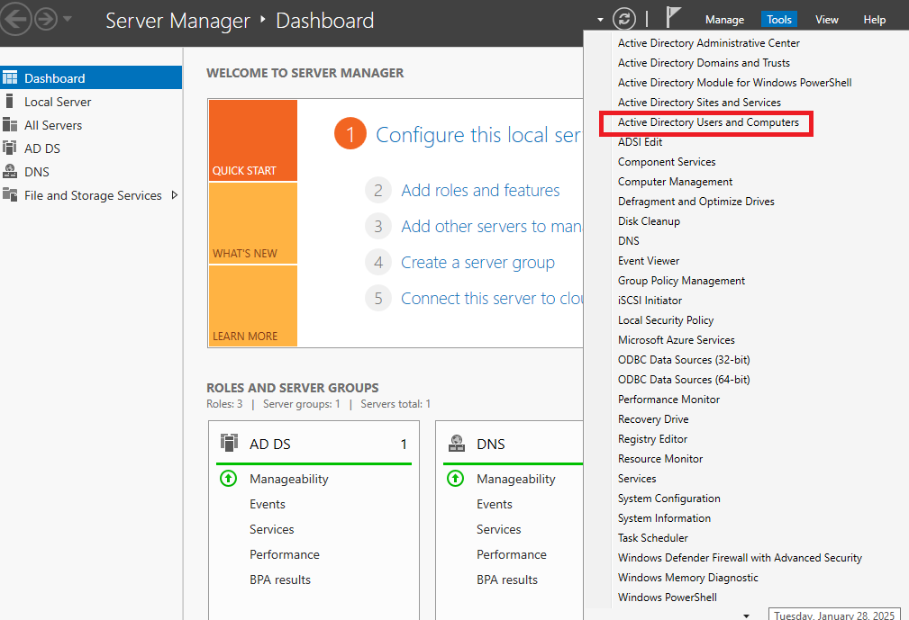
2. Busca dentro de la carpeta del dominio que creaste, la carpeta **Usuarios** y clic en ella.
3. Dentro de esta carpeta vas a copiar el usuario **Administrador**
    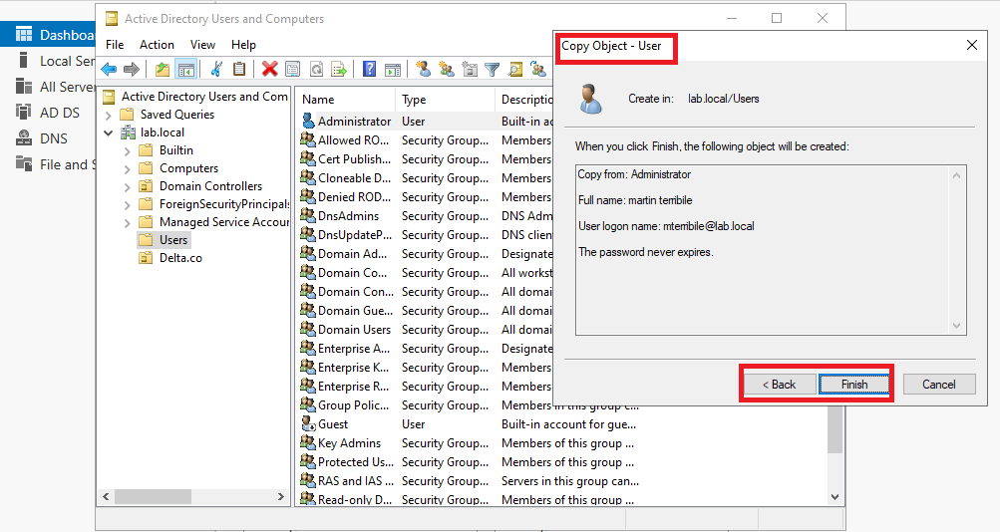
4. Ya con el usuario nuevo creado, te recomiendo que revises que sea parte de los mismos grupos que el usuario **Administrador**

### Paso 2: Deshabilitar la Cuenta de Administrador Predeterminada

1. Abre **Usuarios y equipos de Active Directory**.
2. Navega hasta la carpeta **Usuarios**.
3. Busca la cuenta **Administrador** (su nombre completo es `Administrator`).
4. Haz clic derecho sobre la cuenta y selecciona **Deshabilitar cuenta**.
5. Confirma la acción cuando se te solicite.
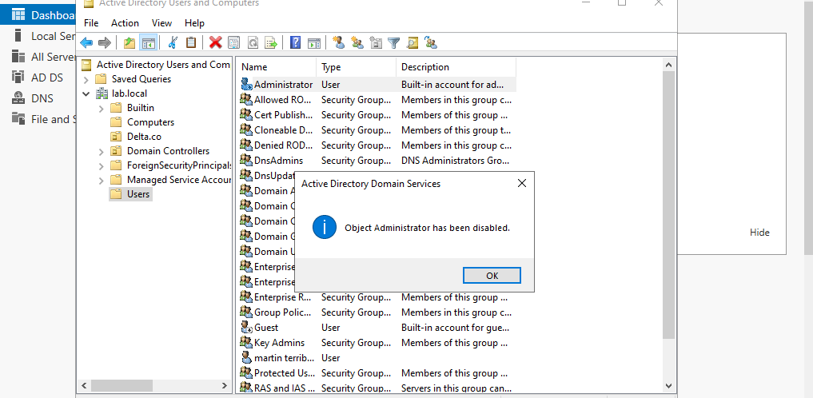

!!! tip 
    Inicia sesion con el nuevo usuario administrador y luego deshabilita la cuenta de administrador predeterminada. Esto es crucial para evitar quedarte sin acceso administrativo.

---

## Unir una Máquina Virtual con Windows 10 al Dominio

1. Primero como buena practica, hay que verificar que mi maquina virtual tenga concetividad con el server de AD, el famoso **`ping`** y que tambien resuelva el nombre de dominio
2. Navegaremos hacia **Configuracion de Red e Internet**
    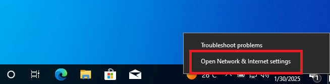
3. Luego iremos a **Cambiar configuracion de adaptador**, abriremos el adaptador **ethernet** e iremos al protocolo **ipv4**
4. Dentro de la cofiguracion del adaptador, colocaremos la direccion ip del servidor de active directory en dns predeterminado
    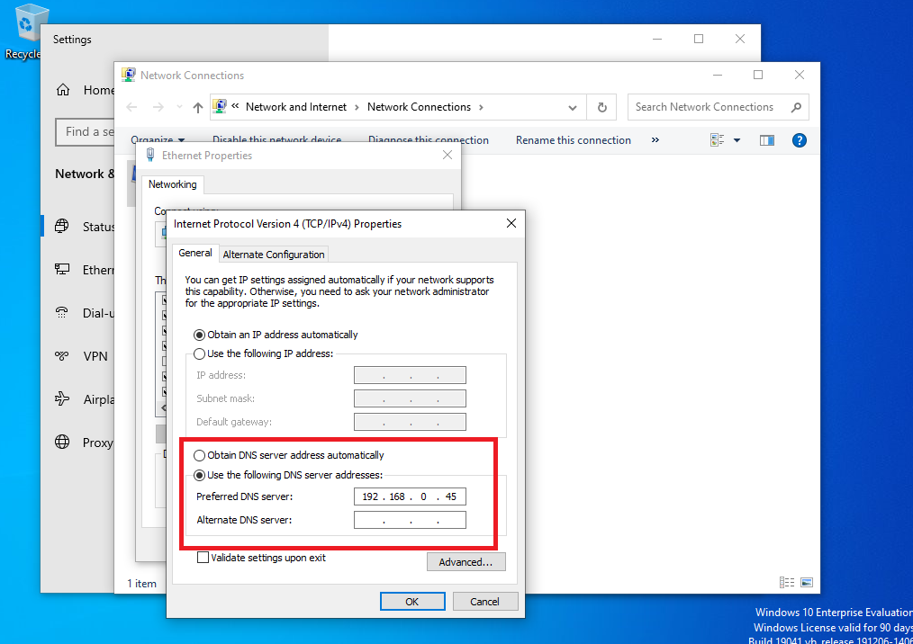
5. Luego iremos a **Acerca de esta pc** y haremos clic en **Renombrar esta PC**
    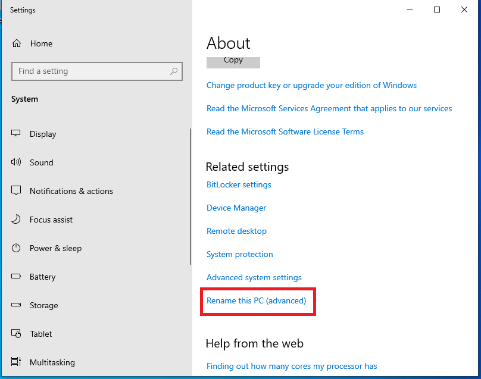
6. Ahora solo agregaremos el **Dominio** que creamos anteriormente, y opcionalmente podremos cambiar el nombre de la pc
    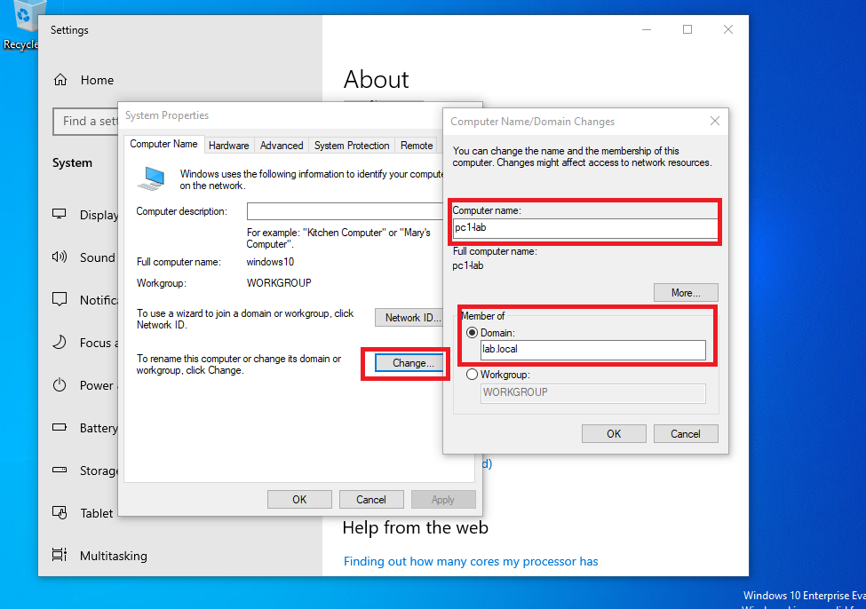
7. Cuando hagamos clic en **ok** nos va a pedir las creedenciales de un usuario con permisos para añadir computadoras a dominio, en este caso colocaremos la del usuario que creamos anteriormente, ya que tiene los permisos de administrador.
    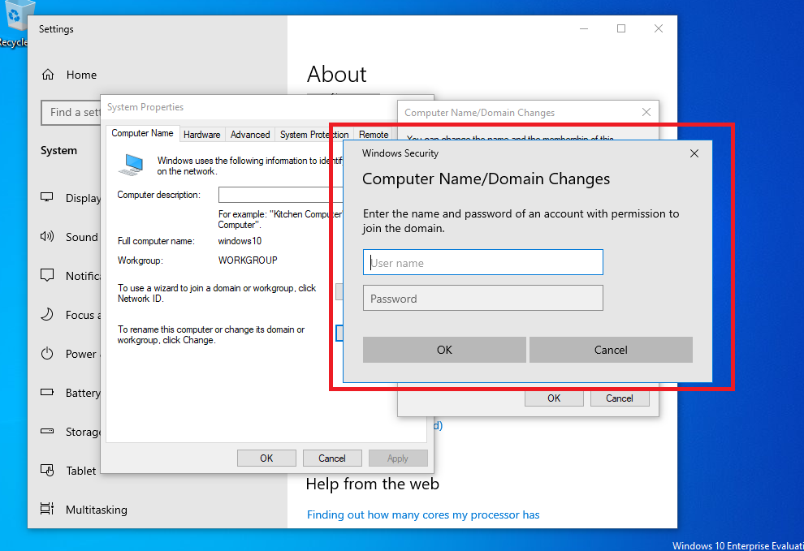
8. Finalmente nos pedira reiniciar la computadora, y ya podremos logearnos dentro del dominio, si queremos corroborar si la pc se unio al dominio, iremos a al servidor, **Usuarios y equipos de Active Directory**, buscaremos nuestro **dominio** y dentro de el la carpeta **equipos**.
    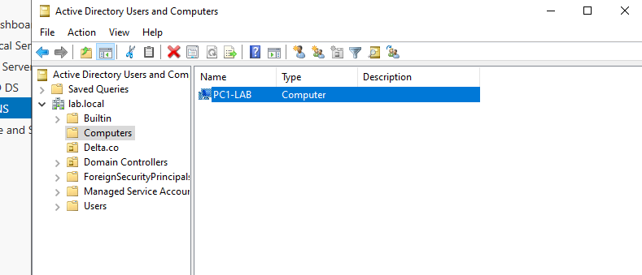

---

### Preguntas Frecuentes (FAQ)

1. **¿Puedo tener múltiples dominios en un solo bosque?**  
   Sí, un bosque puede contener múltiples dominios, pero todos deben compartir un esquema común y una relación de confianza.

2. **¿Qué es el catálogo global en Active Directory?**  
   El catálogo global es una base de datos que contiene información sobre todos los objetos en el bosque, lo que facilita las búsquedas y la autenticación entre dominios.

3. **¿Cómo puedo aplicar políticas de grupo a usuarios o equipos?**  
   Las políticas de grupo (GPO) se pueden aplicar a Unidades Organizativas (OU) que contengan usuarios o equipos. Puedes configurar las GPO desde **Administración de directivas de grupo**. Lo vamos a ver en otro tutorial.

