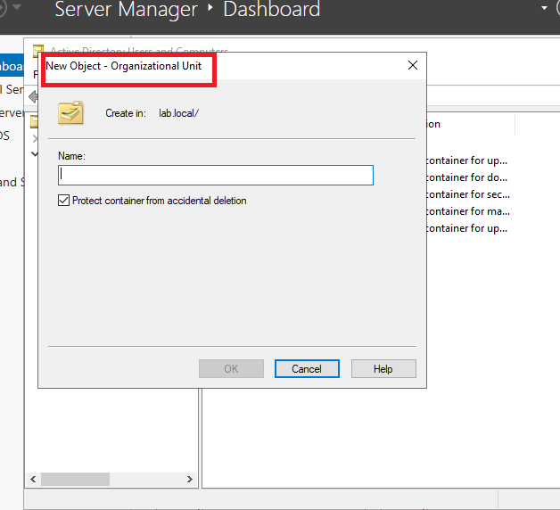
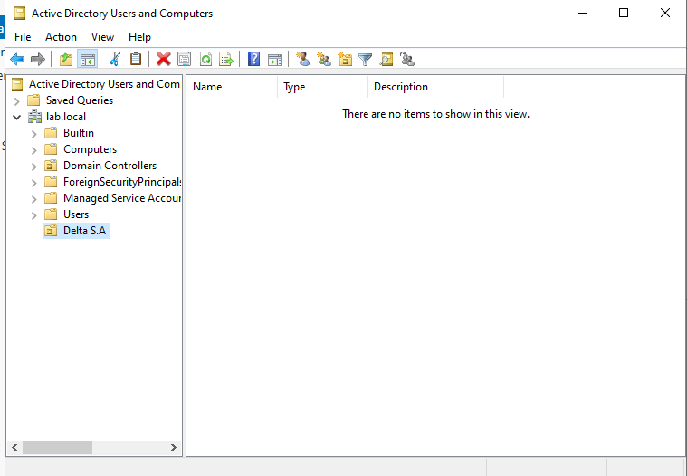
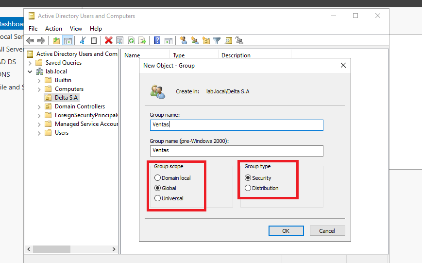
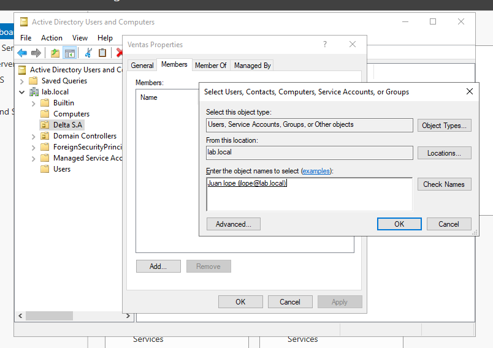
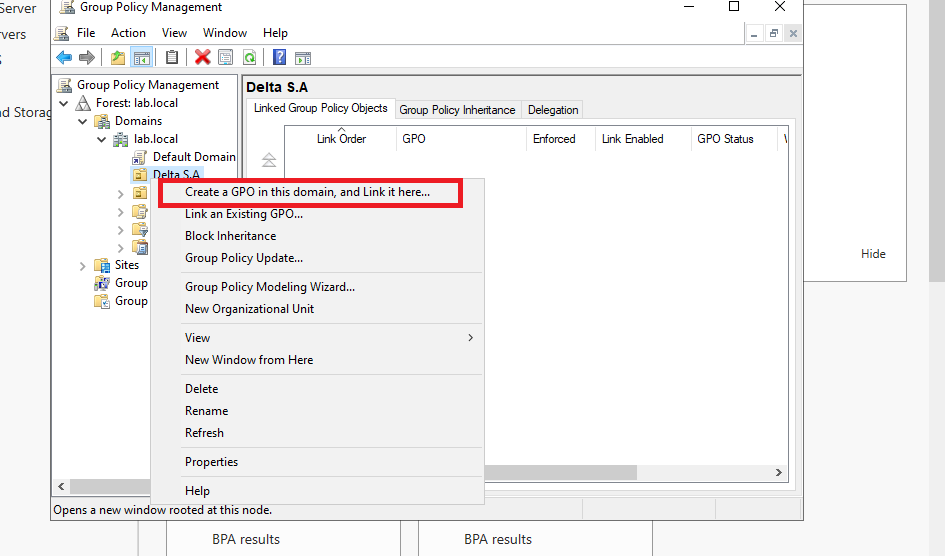
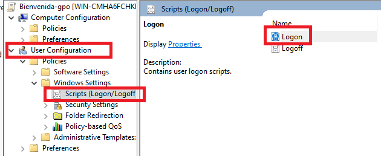
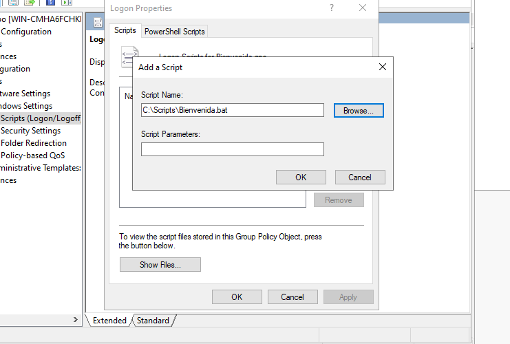

# Crear OU y GPO con Script de Bienvenida en AD 🖥️🔐

En este artículo, te guiaré paso a paso para crear una **Unidad Organizativa (OU)** en **Active Directory (AD)**, aplicar una **Política de Grupo (GPO)** a un grupo de usuarios y configurar un script que se ejecute al iniciar sesión para mostrar un mensaje de bienvenida. Este tutorial es ideal para aquellos que ya tienen un dominio configurado y desean profundizar en la administración de AD.

---

## ¿Qué es una Unidad Organizativa (OU) y una Política de Grupo (GPO)?


### Unidad Organizativa (OU)

Una **Unidad Organizativa (OU)** es un contenedor dentro de un dominio de Active Directory que se utiliza para organizar objetos como usuarios, equipos y grupos. Las OU permiten aplicar políticas de grupo de manera granular y facilitan la administración de recursos en una red.

### Política de Grupo (GPO)

Una **Política de Grupo (GPO)** es un conjunto de configuraciones que se aplican a usuarios y equipos dentro de un dominio o una OU. Las GPOs permiten automatizar tareas como la configuración de seguridad, la instalación de software y la ejecución de scripts.

---

## Creación de una Unidad Organizativa (OU) en Active Directory

### Paso 1: Abrir Usuarios y Equipos de Active Directory

1. Inicia sesión en tu servidor de Active Directory con una cuenta de administrador.
2. Abre **Usuarios y Equipos de Active Directory** desde el menú Inicio o desde el **Administrador del Servidor**.
    
### Paso 2: Crear una Nueva OU

1. En la consola de **Usuarios y Equipos de Active Directory**, navega hasta el dominio en el que deseas crear la OU.
2. Clic derecho sobre el dominio y selecciona **Nuevo > Unidad Organizativa**.
    
3. Asigna un nombre a la OU (por ejemplo, `Delta S.A`) y clic en **Aceptar**.
    

---

## Creación de un Grupo de Usuarios y Asignación a la OU

### Paso 1: Crear un Grupo de Usuarios

1. Dentro de la OU recién creada (`Delta S.A`), clic derecho y selecciona **Nuevo > Grupo**.
2. Asigna un nombre al grupo (por ejemplo, `Ventas`) y selecciona el tipo de grupo **Seguridad**.
3. Clic en **Aceptar** para crear el grupo.
    

??? note "Diferencia entre distribucion y seguridad"
    Los grupos de seguridad en Active Directory se usan para administrar permisos y derechos de acceso a recursos, como carpetas compartidas e impresoras. En cambio, los grupos de distribución solo sirven para enviar correos electrónicos a múltiples usuarios y no pueden asignar permisos.

### Paso 2: Agregar Usuarios al Grupo

1. Clic derecho sobre el grupo `Ventas` y selecciona **Propiedades**.
2. Anda a la pestaña **Miembros** y clic en **Agregar**.
3. Busca y selecciona los usuarios que deseas agregar al grupo, luego haz clic en **Aceptar**.
    

---

## Creación y Aplicación de una Política de Grupo (GPO) con un Script de Bienvenida

### Paso 1: Crear un Script de Bienvenida

1. Abri el **Bloc de notas** o cualquier editor de texto.
2. Escribe el siguiente código para mostrar un mensaje de bienvenida:

    ```batch
    @echo off
    REM Script batch para dar la bienvenida a los usuarios al iniciar sesión en el dominio

    set titulo=¡Bienvenido a Active Directory!
    set mensaje=Hola %USERNAME%, nos alegra verte en el dominio.
    set dominio=%USERDOMAIN%

    title %titulo%
    color 0A
    cls

    echo ==================================================
    echo                BIENVENIDO A %dominio%              
    echo ==================================================
    echo.
    echo  Hola %USERNAME%  
    echo  Esperamos que tengas un gran día en el dominio %dominio%.
    echo.
    echo ==================================================
    echo.

    echo Presiona cualquier tecla para continuar...
    pause >nul
    ```

Explicación del script

- **`@echo off`**: Desactiva la visualización de los comandos mientras se ejecuta el script
- **`REM`**: Permite agregar comentarios en el script que no se ejecutarán
- **`set`**: Crea variables con valores que pueden ser utilizados en el script
- **`title`**: Cambia el título de la ventana de la consola
- **`color`**: Modifica los colores de la consola. El primer dígito (0) es el color de fondo y el segundo (A) el color del texto
- **`cls`**: Limpia la pantalla de la consola
- **`echo`**: Muestra texto en la pantalla
- **`pause >nul`**: Pausa la ejecución del script hasta que se presione una tecla. El >nul evita que se muestre el mensaje "Presione una tecla para continuar..."

3. Guarda el archivo con la extensión `.bat` (por ejemplo, `bienvenida.bat`) en una ubicación accesible, como `C:\Scripts\`.

### Paso 2: Crear una Nueva GPO

1. Abre **Administración de directivas de grupo** desde el menú Inicio o desde el **Administrador del Servidor**.
2. Navega hasta el dominio o la OU donde deseas aplicar la GPO.
3. Haz clic derecho sobre la OU `Delta S.A` y selecciona **Crear un GPO en este dominio y vincularlo aquí**.
4. Asigna un nombre a la GPO (por ejemplo, `GPO-Bienvenida`) y haz clic en **Aceptar**.
    

### Paso 3: Configurar la GPO para Ejecutar el Script de Bienvenida

1. Clic derecho sobre la GPO `GPO-Bienvenida` y selecciona **Editar**.
2. En la consola de **Editor de administración de directivas de grupo**, navega hasta **Configuración de usuario > Directivas > Configuración de Windows > Scripts (Inicio/cierre de sesión)**.
    
3. Haz doble clic en **Iniciar sesión**.
4. Clic en **Agregar** y selecciona el archivo `bienvenida.bat` que creaste anteriormente.
5. Clic en **Aceptar** para guardar la configuración.
    

### Paso 4: Vincular la GPO al Grupo de Usuarios

1. En **Administración de directivas de grupo**, asegúrate de que la GPO `GPO-Bienvenida` esté vinculada a la OU `Delta S.A.`.
2. Verifica que los usuarios del grupo `Ventas` estén dentro de la OU `Delta S.A.`.
    

---

## Verificación del Funcionamiento del Script de Bienvenida

1. Inicia sesión en una máquina unida al dominio con una cuenta de usuario que pertenezca al grupo `Ventas`.
2. Al iniciar sesión, deberías ver un mensaje de bienvenida como el siguiente:
    
    

---

### Preguntas Frecuentes (FAQ)

1. **¿Puedo aplicar una GPO a múltiples OUs?**  
   Sí, puedes vincular una GPO a múltiples OUs dentro del mismo dominio.

2. **¿Cómo puedo verificar si una GPO se está aplicando correctamente?**  
   Puedes usar la herramienta **Resultado de directivas de grupo (GPResult)** en la línea de comandos para verificar la aplicación de GPOs en un equipo o usuario específico.

3. **¿Qué tipos de scripts puedo ejecutar con una GPO?**  
   Puedes ejecutar scripts en **VBScript**, **PowerShell**, **Batch**, entre otros. Solo asegúrate de que el script sea compatible con los sistemas operativos de los clientes.