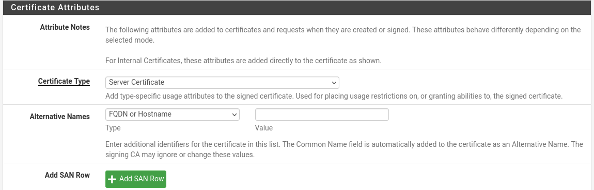
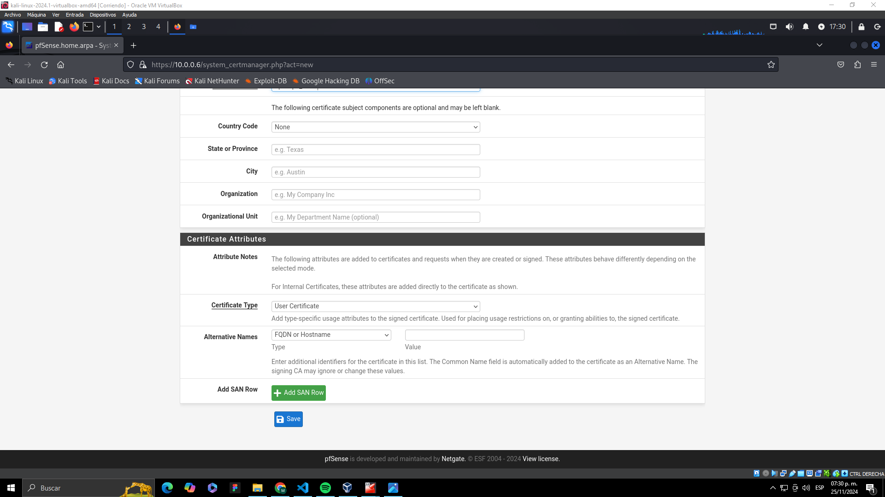
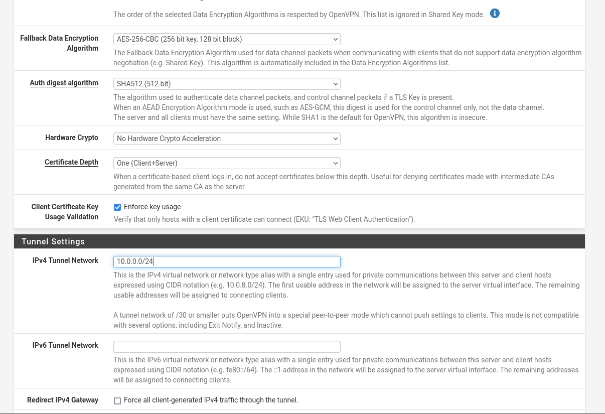
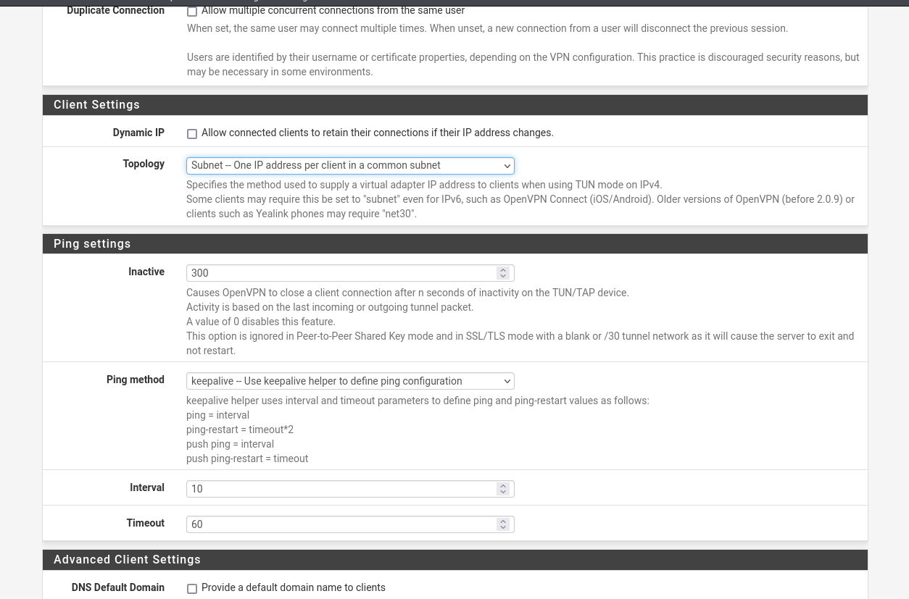

# Configuración de OpenVPN en pfSense 📡🔑

Este tutorial te voy a guiar paso a paso como dejar listo un servidor openVpn, y crear los certificados para que los clientes se puedan conectar

## Crear una Autoridad Certificadora (CA)

Lo primero que tenemos que crear es la autoridad certificadora, basicamente esta autoridad es la entidad que va a verificar los certificados entre la concexion vpn, generando confianza entre ambos.

1. Accede a la interfaz web de pfSense:  
    - Ingresa a `http://<IP_de_pfSense>` en tu navegador.
    - Inicia sesión con tus credenciales de administrador.

2. Dirígete a **System > Cert. Manager > CAs**.

3. Haz clic en **Add** para crear una nueva CA. Configura los siguientes campos:
    - Create /Edit CA
        - **Descriptive Name**: ponemos un nombre descriptivo a esta CA, el que nosotros queramos.
        - **Method**: Create an internal Certificate Authority.
    - Internal Certificate Authority
        - **Key type:** ECDSA con secp521r1 que es compatible con OpenVPN.
        - **Digest Algorithm:** sha512
        - **Lifetime Days:** 3650 (10 años)
        - **Common-name:** el CN debe ser un nombre descriptivo, que describa inequívocamente a esta CA. En nuestro caso solamente tenemos una CA para OpenVPN, así que hemos puesto simplemente «openvpn-ca»
        - **Country Code:** none. Esto ya no es necesario rellenarlo en los nuevos certificados de OpenVPN.

En cuanto al porque la eleccion de la criptografia, **ECDSA (Elliptic Curve Digital Signature Algorithm)** es preferido sobre RSA porque proporciona una seguridad equivalente con claves significativamente más pequeñas, lo que reduce el consumo de recursos y mejora el rendimiento, especialmente en dispositivos con menos capacidad. Por ejemplo, una clave ECDSA de 521 bits ofrece una seguridad comparable a una clave RSA de 15,360 bits. Además, las curvas elípticas como secp521r1 son reconocidas por su robustez criptográfica contra ataques basados en factorización o logaritmos discretos.

El uso de **SHA-512** como algoritmo de hash garantiza una alta resistencia frente a colisiones (situaciones donde dos entradas diferentes producen el mismo hash), gracias a su salida de 512 bits. Esto añade un nivel adicional de integridad y seguridad al proceso de firma. Combinando estos elementos, se logra una configuración moderna, eficiente y altamente segura, ideal para proteger conexiones VPN .

Haz clic en **Save** para guardar la CA.

## Crear un Certificado de Servidor

Ahora tenemos que crear el certificado del servidor, esto es para crear la **"identidad digital"** del servidor, la misma autentica al servidor ante los clientes. 

1. Ve a **System > Cert. Manager > Certificates**.

Vas a ver que ya hay un certificado creado, este corresponde al certificado ssl para que la pagina web funcione sobre https.
>쯇or que aparece que la pagina no es segura? === Porque el certificado esta autofirmado.

2. Haz clic en **Add** y selecciona los siguientes parámetros:
    - Create /Edit CA
        - **Descriptive Name**: ponemos un nombre descriptivo.
        - **Method**: Create an internal Certificate.
    - Internal Certificate
        - **Key type:** ECDSA con secp521r1 que es compatible con OpenVPN.
        - **Digest Algorithm:** sha512
        - **Lifetime Days:** 3650 (10 años)
        - **Common-name:** el CN debe ser un nombre descriptivo
        - **Country Code:** none. Esto ya no es necesario rellenarlo en los nuevos certificados de OpenVPN.
    - Certificate Attributes:
        - **Certificate Type:** server certificate
        - **Alternative Name:** lo podemos dejar sin nada, completamente vacío.

Haz clic en **Save** para crear el certificado.

## Crear Certificado de Cliente

Ahora vamos a crear el certificado de cliente, este certificado vas a tener que crearlo, cada vez que quieras habilitar una conexion vpn nueva.

1. Ve a **System > Cert. Manager > Certificates**.

2. Haz clic en **Add** y selecciona los siguientes parámetros:
    - Create /Edit CA
        - **Descriptive Name**: ponemos un nombre descriptivo.
        - **Method**: Create an internal Certificate.
    - Internal Certificate
        - **Key type:** ECDSA con secp521r1 que es compatible con OpenVPN.
        - **Digest Algorithm:** sha512
        - **Lifetime Days:** 3650 (10 años)
        - **Common-name:** el CN debe ser un nombre descriptivo
        - **Country Code:** none. Esto ya no es necesario rellenarlo en los nuevos certificados de OpenVPN.
    - Certificate Attributes:
        - **Certificate Type:** user certificate
        - **Alternative Name:** lo podemos dejar sin nada, completamente vacío.

Haz clic en **Save** para crear el certificado.

## Configurar el Servidor OpenVPN

1. Dirígete a **VPN > OpenVPN > Servers** y haz clic en **Add** para agregar un nuevo servidor OpenVPN.

2. Configura los campos principales como sigue:
    - General Information
        - **Description:** Descripcion acorde a la vpn.
    - Mode Configuration:
        - **Mode Access:** Remote access (SSL/TLS)
        - **Device Mode:** tun
    - Enpoint Configuration:
        - **Protocol**: UDP (elegi esta opcion para evitar ataques de DDoS).
        - **Port:** 1194 (para metodos didacticos dejamos el puerto por defecto, pero se recomienda cambiarlo)
        - **Interface:** WAN
    Cryptographic Settings:
        - **Server certificate:**Aca colocaremos el certificado de serrvidor que creamos anteriormente
        - **DH Parameter Length:** Colocar solo curvas ECDH
        - **ECDH Curve:** Yo deje la misma curva que habiamos colocado anteriormente, para moayor seguridad.
        - **Data Encryption Algorithms:** Ya por defecto vienen seleccionados los 3 algoritmos que me parecieron los mas fuertes
        - **Fallback Data Encryption Algorithm:** Yo deje como fallback AES-256-CBC, igualmente recomiendo dejar AES-256-GCM, si hay dispositovos que no soporten este algoritmo la mejor practica seria actualizarlos.
        - **Auth digest algorithm:** SHA-512
        - **Certificate Depth:** Colocar ONE(Client + Server)

Dentro de estas configuraciones podremos tambien limitar a que redes se podra conectar nuestro servidor vpn para asi poder limitar el acceso a nuestra red `IPv4 Local network(s)`, asi como tambien la cantidad de conexiones activas al mismo tiempo en  `Concurrent connections`.

Finalmente seleccionaremos como toplogia `subnet`, siendo esta mas efectiva que `net30`

Haz clic en **Save** y luego en **Apply Changes**.

## BONUSTRACK: Exportar la Configuración del Cliente OpenVPN

1. Instala el paquete **OpenVPN Client Export Utility**:
   - Ve a **System > Package Manager > Available Packages**.
   - Busca `openvpn-client-export` y haz clic en **Install**.

Ve a **VPN > OpenVPN > Client Export**

    - Vamos hasta el final en donde diga OpenVpn Clients
    - Recomiendo exportar la configuración haciendo click en most clients

## Probar la Conexión

1. En un dispositivo cliente, instala un cliente OpenVPN (como [OpenVPN Connect](https://openvpn.net/vpn-client/)).

2. Importa el archivo `.ovpn` descargado y conecta al servidor.

3. Verifica que la conexión sea exitosa y que puedas acceder a los recursos necesarios.

¡Con esto, tu servidor OpenVPN en pfSense estará configurado y listo para ser utilizado!
